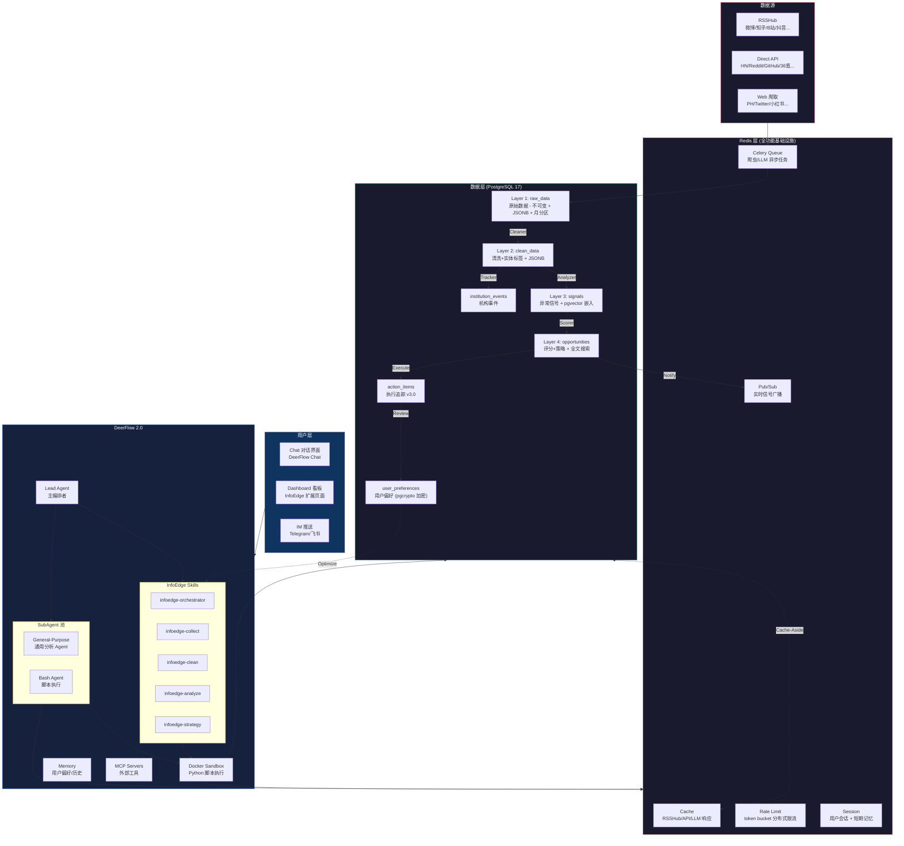
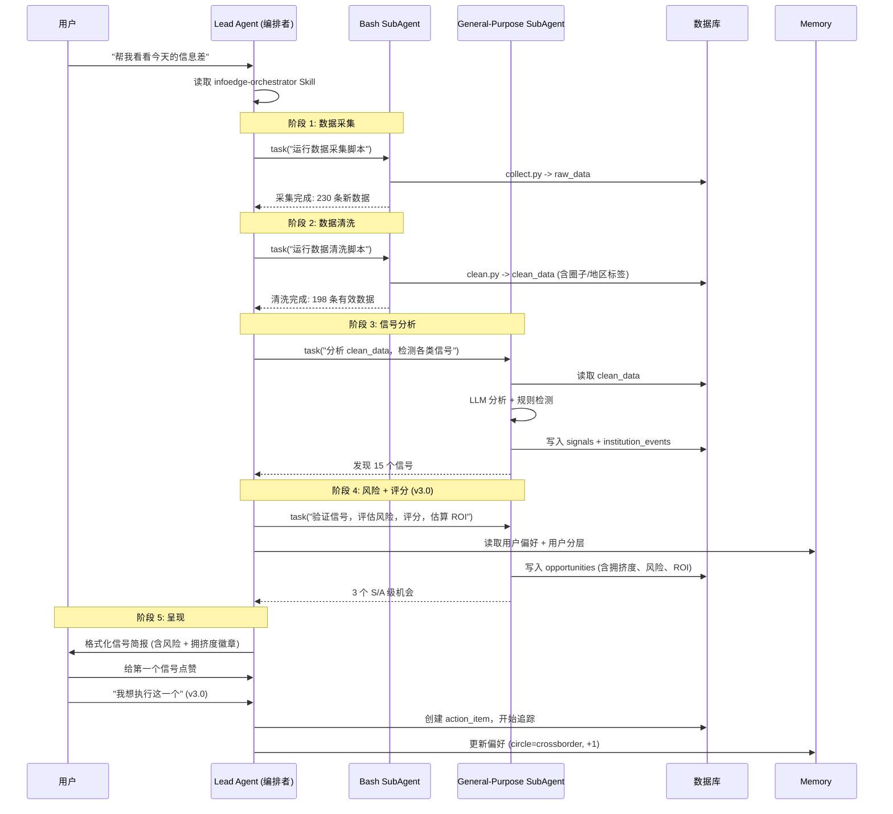
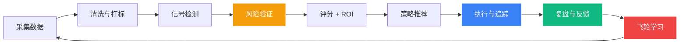

# InfoEdge - 产品需求文档 (PRD)

> **版本**: v3.4
> **更新日期**: 2026-04-25
> **产品**: InfoEdge - 信息差套利智能平台
> **框架**: DeerFlow 2.0 (字节跳动) + OpenAI 兼容 LLM
> **部署**: Docker Compose
> **v3.0 更新**: 新增 Risk Engine、Execution Tracking、User Tiers、Knowledge Base
> **v3.1 更新**: UI全中文本地化 (All UI text in Chinese)
> **v3.2 更新**: AI每日简报、跨源共振、数据新鲜度、情景推演、复合评分OCI、源可信度分层、MCP Server、自适应轮询、地图热力图、预测市场、本地AI离线 (参考 [WorldMonitor](https://github.com/koala73/worldmonitor))
> **v3.3 更新**: 数据层升级 — SQLite 全面替换为 **PostgreSQL 17**（JSONB + pgvector + 全文搜索 + 分区表 + PITR 备份）；Redis 升级为**全功能基础设施**（缓存 + Celery 任务队列 + 限流 + Pub/Sub + 会话）；新增数据保留策略、备份恢复、容量预算、法律合规与免责声明、个人金融信息加密（C2 级）；废弃 SQLite 旧数据，PG 从零启动；暂不引入对象存储 (S3)。
> **v3.4 更新**: 信息差模型升级 — 新增**传播速度差/价格差/供需差** 3 种信息差类型（共 8 类型）；**双向地理差**检测（CN→US + US→CN）；**话题归一化引擎**（跨语言实体消歧，所有跨源分析的前置依赖）；**评分-标签强绑定**（评分必须从 clean_data 标签读取，禁止平台名硬编码推断）；新增**价格/交易数据源**（1688/淘宝/Amazon 价格 API）；**负面信息差**检测（别人不知道的坏消息）；Redis 缓存与 Celery broker 分离；raw_data payload 大小截断。

---

## 目录

1. [产品概述](#1-产品概述)
2. [用户画像与场景](#2-用户画像与场景)
3. [用户分层体系](#3-用户分层体系) :star: v3.0
4. [圈子与地区体系](#4-圈子与地区体系)
5. [系统架构](#5-系统架构)
6. [多 Agent 设计](#6-多-agent-设计)
7. [数据流与数据模型](#7-数据流与数据模型)
8. [功能列表](#8-功能列表)
9. [Risk Engine 风险引擎](#9-risk-engine-风险引擎) :star: v3.0
10. [Execution Tracking 执行追踪](#10-execution-tracking-执行追踪) :star: v3.0
11. [知识库与新手引导](#11-知识库与新手引导) :star: v3.0
12. [智能能力增强](#12-智能能力增强) :star: v3.2
13. [前端页面](#13-前端页面)
14. [API 设计](#14-api-设计)
15. [飞轮与个性化](#15-飞轮与个性化)
16. [非功能性需求](#16-非功能性需求)
17. [验收标准](#17-验收标准)
18. [UI 语言要求](#18-ui-语言要求) :star: v3.1
19. [术语表](#19-术语表)

---

## 1. 产品概述

### 1.1 产品定位

InfoEdge 是一个**多 Agent 协同**的信息差发现与套利平台。
系统自动采集全球 10+ 数据源，通过多个专业 AI Agent 完成完整的 **发现 > 验证 > 决策 > 执行 > 复盘** 闭环：

- 数据清洗与结构化
- 信号异常检测
- 跨地区/跨圈子的信息差发现
- **信号验证与风险评估** :star: v3.0
- 企业/VC 动作追踪
- 变现策略推荐
- **ROI 估算与执行追踪** :star: v3.0
- **知识库与新手引导** :star: v3.0

用户通过**对话**与 Agent 团队交互，系统通过**点赞/点踩**反馈与**执行复盘**形成数据飞轮，持续提升推荐准确度。

### 1.2 产品愿景

> **让每个人都能像投资机构一样发现信息差，并知道如何执行。**

### 1.3 产品闭环 (v3.0 核心升级)

> [!IMPORTANT]
> v2.0 只做了"发现"。v3.0 完成了完整的五环闭环，把产品从"看信号"升级为"赚到钱"。

```
+----------+    +----------+    +----------+    +----------+    +----------+
|  发现     |    |  验证     |    |  决策     |    |  执行     |    |  复盘     |
|  Discover|    |  Validate|    |  Decide  |    |  Execute |    |  Review  |
| 信号检测  | -> | 风险评估  | -> | ROI 估算  | -> | 执行追踪  | -> | 胜率统计  |
| 信息差    |    | 拥挤度    |    | 盈亏比    |    | 进度看板  |    | 案例归档  |
| 圈子分析  |    | 证伪验证  |    | 难度标签  |    | 止损告警  |    | 经验沉淀  |
+----------+    +----------+    +----------+    +----------+    +----------+
   v2.0 已完成     v3.0 新增     v3.0 新增     v3.0 新增     v3.0 新增
```

### 1.4 核心价值主张

| 价值 | 描述 |
|------|------|
| **领先市场** | 比主流媒体早 6-72 小时发现信号 |
| **跨维度** | 同时覆盖 10+ 平台、10 个圈子、5+ 地区 |
| **可验证** | 不止发现，还会验真伪、评风险、看竞争 :star: v3.0 |
| **可执行** | 告诉你"投多少、赚多少、怎么做" :star: v3.0 |
| **可追踪** | 从发现到执行到复盘的全流程看板追踪 :star: v3.0 |
| **持续进化** | 反馈飞轮 + 历史胜率回测，准确度不断提升 |

### 1.5 技术栈

| 层 | 技术 | 说明 |
|----|------|------|
| **Agent 框架** | DeerFlow 2.0 (字节跳动) | LangGraph 编排、Sandbox 执行、Skills 体系、IM 推送、Memory |
| **LLM 协议** | OpenAI 兼容 | 用户配置 base_url + api_key，支持任意兼容模型 |
| **前端** | DeerFlow 内置 Next.js 16 + React 19 | Shadcn UI + Radix + TailwindCSS 4 + Lucide |
| **后端 API** | FastAPI (InfoEdge 扩展端点) | DeerFlow Gateway + 自建 Dashboard API |
| **数据库** | **PostgreSQL 17** (主库) | JSONB 嵌套存储 + pgvector 向量检索 + 全文搜索 (zhparser/pg_trgm) + 分区表 (按月) + PITR 时间点恢复；分层存储 raw → clean → signal → opportunity；C2 级个人金融信息字段加密 (pgcrypto) |
| **缓存与队列** | **Redis 7** (全功能基础设施) | ① 热点缓存 (RSSHub/API/LLM 响应)；② Celery 任务队列 (爬虫/LLM 异步任务)；③ 分布式限流 (token bucket)；④ Pub/Sub 实时消息广播 (信号推送)；⑤ 用户会话 + 短期记忆；持久化采用 AOF every-second |
| **ORM 与迁移** | SQLAlchemy 2.0 + Alembic | 异步驱动 asyncpg；schema 版本化迁移 |
| **任务队列** | Celery 5 + Redis broker | 爬虫调度 / LLM 推理 / 报告生成；APScheduler 触发周期任务 |
| **数据采集** | RSSHub (自建) + 直连 API + Web 爬取 | 覆盖中英文 10+ 平台；遵守 robots.txt 与各平台 ToS |
| **部署** | Docker Compose | DeerFlow + RSSHub + **PostgreSQL** + **Redis** + **Celery Worker** 容器；暂不引入对象存储 (S3)，文件存于本地卷 |

---

## 2. 用户画像与场景

### 2.1 目标用户：信息差商人

> **核心定义**：InfoEdge 的目标用户只有一种 — **信息差商人**。不论从事跨境电商、内容创作、投资、技术开发还是量化交易，他们的共同特征是：**善于发现信息不对称，快速评估风险，果断执行变现**。

| 维度 | 画像 |
|------|------|
| **核心身份** | 利用信息差获利的人 — 不是信息消费者，而是信息套利者 |
| **思维模式** | 别人看到新闻，他看到机会；别人还在讨论，他已经在执行 |
| **关键能力** | 快速判断信息差是否存在 → 评估窗口期和风险 → 找到最短变现路径 |
| **核心痛点** | 信息太多、信号太少；知道得晚、执行得更晚；缺乏系统化的信息差发现工具 |
| **资金规模** | 从 0 成本副业到千万级投资 — 分层见 §3，但本质都是商人 |
| **变现路径** | 跨境选品 / 内容套利 / 投资决策 / 技术产品化 / 价格套利 / 认知变现 / 政策布局 — 变现路径不同，底层逻辑相同：**信息差 → 风险评估 → 快速执行** |
| **使用方式** | 每天打开平台 → 浏览信号简报 → 对高价值信号做深度分析 → 执行 → 复盘 → 持续优化 |

### 2.2 核心使用场景

#### 场景 1: 跨境电商选品

```
用户: "帮我找海外 TikTok 火爆但中国还没有的产品"

Agent 团队执行:
1. Collector Agent -> 采集 TikTok/Reddit/PH 最新数据
2. Cleaner Agent -> 清洗，打地区标签 (us)、圈子标签 (crossborder)
3. Geo-Arbitrage Agent -> 检测英文平台热 + 中文平台 (1688/淘宝) 冷的产品
4. Risk Agent -> 评估拥挤度 + 风险 + 信号验证 (v3.0)
5. Strategist Agent -> 匹配"跨境电商"Playbook，生成选品建议 + ROI 估算

输出:
[S-92] MagSafe 折叠充电宝 - TikTok US 50万播放，1688 搜索指数 +320%
  | 地区差: 美国爆火，中国搜索量极低
  | 拥挤度: 15/100 蓝海 - 几乎没人知道 (v3.0)
  | 风险: 低 - 无政策风险，供应充足 (v3.0)
  | ROI: 投入 5000 元 -> 预估回报 8000-20000 元 (30 天) (v3.0)
  | 策略: 1688 找货 -> TikTok Shop 测款 -> 预估毛利 40-60%
  | 时间窗口: ~72 小时
  | 难度: 低门槛 (v3.0)
  | [有用] [没用] [开始执行] (v3.0)
```

#### 场景 2: 投资信号追踪

```
用户: "a16z 和红杉最近都在投什么？"

Agent 团队执行:
1. Collector Agent -> 采集 36氪/TechCrunch/Crunchbase 投资数据
2. Institution Tracker -> 提取机构 + 事件 + 金额 + 行业
3. Analyst Agent -> 分析投资频次、行业聚集、异常趋势

输出:
[A-85] a16z 连续 3 周投 AI Agent 基础设施
  | 标的: LangSmith (B 轮)、AgentOps (A 轮)、BoundaryML (种子轮)
  | 行业: AI Agent DevTools
  | 拥挤度: 28/100 早期阶段 (v3.0)
  | 洞察: AI 圈已热，但大众/消费圈尚不知该赛道
  | 策略: 关注开源替代品，或为非技术用户构建 Agent 应用
  | [有用] [没用]
```

#### 场景 3: 每日信息差巡查

```
用户: "帮我看看今天有哪些值得关注的信息差"

Agent 团队执行: 完整 Pipeline (采集->清洗->分析->验证->评分->策略)

输出:
每日信息差简报 | 2026-04-21 | 发现 12 个信号 | 系统胜率: 62%

红色 S 级 (1):
  [S-95] Rust 在量化交易中替代 C++ - 量化/开发圈热议，大众圈不了解
    拥挤度: 蓝海 | 风险: 低 | 难度: 高门槛

橙色 A 级 (3):
  [A-87] 欧盟碳关税 5 月生效 - 欧盟政策圈已落地，中国贸易圈反应不足
  [A-83] AI 视频工具 Sora 替代品爆发 - HN/Reddit 热议，B 站/抖音尚未跟进
  [A-81] 东南亚直播电商增长 300% - 出海圈热议，国内电商圈未关注

黄色 B 级 (5) ...
```

---

## 3. 用户分层体系

> [!IMPORTANT]
> 不同层次的信息差商人对信息的理解能力、资金规模、执行能力完全不同。系统必须为不同用户提供不同深度的内容与引导。

### 3.1 用户分层定义

| | 鹰：高级信息差商人 | 狐：中级信息差商人 | 猫：普通信息差商人 |
|---|---|---|---|
| **典型身份** | 连续创业者、基金合伙人、供应链操盘手、专业套利者 | 成熟电商卖家、区域分销商、中小企业主、持续套利者 | 副业者、个体创业者、自媒体新手、兼职套利者 |
| **可调用资金** | 500 万+ 人民币 | 10 万 - 500 万 人民币 | 0 - 10 万 人民币 |
| **团队规模** | 有团队 (10+ 人) | 小团队 (3-10 人) | 个人或 1-2 人 |
| **信息来源** | 闭门会议、第一手关系、投行报告 | 行业群、付费社群、垂直媒体 | 微信公众号、抖音、微博 |
| **决策速度** | 快 (经验判断) | 中 (需要数据支撑) | 慢 (需要被说服与教育) |
| **核心诉求** | 独家性、领先性、竞争分析 | 已验证机会、清晰 ROI、风险控制 | 手把手指导、低门槛、可复制 |

### 3.2 分层注册与个性化

用户首次使用完成分层设置：

```
Onboarding 流程:
Step 1: "你想用信息差做什么？" (选择变现方向，多选)
   [跨境电商] [内容套利] [投资决策] [技术产品化] [价格套利] [认知变现] [政策布局]
Step 2: "你关注哪些领域？" (选择圈子，多选)
   [VC 投资] [AI 科技] [量化金融] [跨境电商] [开发者] ...
Step 3: "你所在的市场？"
   [国内] [出海] [跨境] [全球]
Step 4: "你的资金范围？"
   [<1 万] [1-10 万] [10-100 万] [100 万+]
=> 自动设置用户分层 + 偏好变现路径 => 个性化首页内容
```

### 3.3 分层内容差异

| 模块 | 鹰看到的 | 狐看到的 | 猫看到的 |
|------|---------|---------|---------|
| **信号卡** | 原始数据 + 拥挤度评分 + 风险评级 | 信号 + ROI 估算 + 难度 | 信号 + 通俗解释 + 教程链接 |
| **策略详情** | 风险验证报告 + 看空论据 + 回测数据 | Playbook + ROI 计算器 + 供应链情报 | 图文教程 + 一键执行清单 |
| **Dashboard** | 多维度自定义 + 自定义数据源 | 标准看板 + 执行追踪面板 | 简化视图 + 今日精选 + 新手引导 |
| **通知** | S 级实时推送 + 竞争预警 | S/A 级推送 + 执行提醒 | 每日精选 1-3 条 + 学习内容 |
| **专属功能** | 团队协作、自定义数据源、回测 | 执行面板、ROI 计算器、供应链 | 知识库、案例轮播、一键执行 |

### 3.4 执行难度标签

每个信号/机会卡片都展示直观的难度标签：

| 标签 | 颜色 | 含义 | 典型资源需求 |
|------|------|------|-------------|
| 绿色：零门槛 | `#10b981` | 只需手机 + 电脑，0 成本启动 | 时间：几小时；资金：0 |
| 黄色：低门槛 | `#f59e0b` | 需要少量启动资金 | 时间：1-3 天；资金：1K-5K |
| 橙色：中门槛 | `#f97316` | 需要专业技能或较多资金 | 时间：1-2 周；资金：5K-50K |
| 红色：高门槛 | `#ef4444` | 需要团队、大资金或特定资源 | 时间：1 个月+；资金：50K+ |

---

## 4. 圈子与地区体系

### 4.1 圈子定义 (10 个圈子)

> [!IMPORTANT]
> 圈子是 InfoEdge 信息差检测的核心维度。不同圈子的信息传播速度与渗透率不同，信息差就存在于信息从小众圈子扩散至大众圈子的过程中。

| 代码 | 圈子名称 | 信息差密度 | 核心特征 | 关联平台 |
|------|---------|-----------|---------|---------|
| `vc` | VC/投资圈 | 5/5 | 投资信息天然不对称，比趋势早 6-12 个月 | 36氪融资、Crunchbase、IT 桔子 |
| `ai` | AI/深科技圈 | 5/5 | 论文到产品延迟 6-18 个月，理解门槛极高 | ArXiv、HN、GitHub、Papers with Code |
| `quant` | 量化/金融圈 | 4/5 | 交易策略天然保密，数据分析为护城河 | QuantFinance Reddit、Wilmott |
| `crossborder` | 跨境电商圈 | 4/5 | 中国与海外的供需信息严重不对称 | TikTok 趋势、Amazon、1688 |
| `dev` | 开发者/开源圈 | 4/5 | 技术工具被开发者验证比大众早 6 个月 | GitHub Trending、HN、V2EX |
| `overseas` | 出海圈 | 3/5 | 各国市场信息极度碎片化 | ProductHunt、各国 AppStore |
| `consumer` | 消费/新品牌圈 | 3/5 | 消费趋势从小众到大众有传播延迟 | 小红书、抖音、淘宝趋势 |
| `policy` | 政策/宏观圈 | 3/5 | 政策发布到市场反应有时间窗口 | 政府 RSS、36氪、财经媒体 |
| `academic` | 学术/研究圈 | 2/5 | 研究到产业化周期最长 | ArXiv、Google Scholar |
| `general` | 大众/社交媒体圈 | 1/5 | 信息已广泛传播，差距最小 | 微博、抖音、B 站 |

### 4.2 圈子打标规则

每条数据基于**来源平台**与**内容语义**打圈子标签：

| 平台 | 默认圈子 | 内容触发的叠加圈子 |
|------|---------|-------------------|
| HackerNews | `dev` | 含 AI/ML 关键词 -> `ai`；含融资关键词 -> `vc` |
| GitHub Trending | `dev` | 含 AI/ML -> `ai` |
| Reddit r/programming | `dev` | - |
| Reddit r/startups | `vc` | 含跨境关键词 -> `crossborder` |
| Reddit r/Entrepreneur | `crossborder` | - |
| Reddit r/algotrading | `quant` | - |
| ProductHunt | `overseas` | 含开发工具 -> `dev` |
| 36氪 | 融资 -> `vc`；科技 -> `ai`；消费 -> `consumer` | - |
| 微博 | `general` | 含科技关键词 -> `consumer` |
| 抖音 | `general` | 含购物关键词 -> `consumer` |
| B 站 | `general` | 含科技教程 -> `dev` |
| 小红书 | `consumer` | 含跨境/代购 -> `crossborder` |
| V2EX | `dev` | - |
| ArXiv | `academic` | 含 AI/CS -> `ai` |

### 4.3 地区定义

| 代码 | 地区 | 典型平台 |
|------|------|---------|
| `cn` | 中国大陆 | 微博、知乎、B 站、抖音、小红书、36氪、V2EX |
| `us` | 美国 | HN、Reddit、ProductHunt、Twitter/X |
| `eu` | 欧洲 | 欧洲政策站、欧洲科技媒体 |
| `jp` | 日本 | - (Phase 2 扩展) |
| `sea` | 东南亚 | - (Phase 2 扩展) |
| `global` | 全球 | GitHub、ArXiv |

### 4.4 信息差类型矩阵

> [!IMPORTANT]
> v3.4 将信息差模型从 5 维扩展至 8 维。前 5 维为**基础评分维度**（权重合计 100%，决定 OCI 基础分）；后 3 维为 **v3.4 增强检测维度**（作为评分修正因子 ±bonus，不参与基础权重分配）。

**基础评分维度（权重合计 100%）：**

| 信息差类型 | 代码 | 检测维度 | 评分权重 | 示例 |
|-----------|------|---------|---------|------|
| **地理差** | `geo` | 跨地区平台热度对比（**双向**：US→CN 与 CN→US） | 20% | 美国爆 -> 中国还没有；中国直播电商 -> 海外刚起步 |
| **圈子差** | `circle` | 跨圈子渗透对比 | 20% | VC 在投 -> 大众不知道 |
| **时间差** | `time` | 信号首发时间 vs 主流媒体覆盖时间 | 25% | 论文已发布 -> 媒体未报道 |
| **认知差** | `cognitive` | 理解门槛高度 | 15% | 量化策略 -> 散户看不懂 |
| **可操作差** | `actionable` | 能否快速执行变现 | 20% | 供应链信息 -> 立刻能进货 |

**v3.4 增强检测维度（评分修正因子 ±bonus）：**

| 信息差类型 | 代码 | 检测维度 | 修正规则 | 示例 |
|-----------|------|---------|---------|------|
| **传播速度差** :star: v3.4 | `propagation` | 同一信息在不同平台/语言间的传播延迟梯度 | 传播延迟 >3 天 → time_gap +15；>7 天 → +25 | HN 爆火 3 天后 36 氪才报道，7 天后微博才有 |
| **价格差** :star: v3.4 | `price` | 同一商品/服务在不同平台/地区的价格差异 | 价差 >30% → actionability +20；>50% → +30 | 1688 进价 ¥15 / Amazon 售价 $35 |
| **供需差** :star: v3.4 | `supply_demand` | 同一品类在不同市场的供需失衡 | 供需比 <0.3 → geo_gap +15；卖家增速 >100% → crowding +20 | A 平台供大于求、B 平台供不应求 |

> **负面信息差**（v3.4 新增）：以上所有维度均支持**负面方向**检测。例如：某产品海外已曝安全问题但国内还在热卖 = 负面地理差，对**风险引擎**（§9）有极高价值。详见 §9.3.1。

---

## 5. 系统架构

### 5.1 总体架构



### 5.2 部署架构

```yaml
# docker-compose.yml
services:
  deerflow:        # Agent runtime + Frontend + Gateway
    ports: [2026, 3000, 8001, 2024]
  infoedge-api:    # InfoEdge Dashboard 扩展 API (FastAPI)
    ports: [8000]
    depends_on: [postgres, redis]
  infoedge-worker: # Celery Worker - 爬虫/LLM/报告异步任务
    command: celery -A infoedge worker -l info -Q crawl,llm,report
    depends_on: [postgres, redis]
  infoedge-beat:   # Celery Beat - 周期任务调度 (替代 APScheduler 单点)
    command: celery -A infoedge beat -l info
    depends_on: [redis]
  rsshub:          # RSS 数据采集引擎
    ports: [1200]
    depends_on: [redis]
  postgres:        # PostgreSQL 17 主库 (JSONB + pgvector + pgcrypto)
    image: pgvector/pgvector:pg17
    ports: [5432]
    volumes: [pgdata:/var/lib/postgresql/data, ./backups:/backups]
    environment:
      POSTGRES_DB: infoedge
      POSTGRES_USER: infoedge
      POSTGRES_PASSWORD: ${PG_PASSWORD}
  redis:           # Redis 7 - 缓存 + 队列 + 限流 + Pub/Sub + 会话
    image: redis:7-alpine
    command: redis-server --appendonly yes --appendfsync everysec --maxmemory 2gb --maxmemory-policy allkeys-lru
    ports: [6379]
    volumes: [redisdata:/data]

volumes:
  pgdata:
  redisdata:
```

> **说明**：暂不引入对象存储 (S3/MinIO)，导出文件、报告 PDF 等存于本地卷 `./exports`；后续单实例存储 > 100 GB 时再评估迁移。

---

## 6. 多 Agent 设计

### 6.1 Agent 角色定义

在 DeerFlow 中，多 Agent 协同通过 **Lead Agent + SubAgents + Skills** 实现：

| Agent 角色 | DeerFlow 映射 | 职责 | 触发方式 |
|-----------|--------------|------|---------|
| **Orchestrator 编排者** | Lead Agent + `infoedge-orchestrator` Skill | 理解用户意图，编排工作流，汇总结果 | 用户对话 |
| **Collector 采集者** | Bash SubAgent + `infoedge-collect` Skill | 从 10+ 数据源采集原始数据 | Orchestrator 委派 |
| **Cleaner 清洗者** | Bash SubAgent + `infoedge-clean` Skill | 清洗、实体抽取、圈子/地区打标 | Collector 之后 |
| **Analyst 分析者** | General-Purpose SubAgent + `infoedge-analyze` Skill | 信号检测、地理差、圈子差、机构追踪 | Cleaner 之后 |
| **Strategist 策略者** | General-Purpose SubAgent + `infoedge-strategy` Skill | 5 维评分、Playbook 匹配、策略生成、**风险评估 + ROI 估算** | Analyst 之后 |
| **Flywheel 飞轮** | Lead Agent + Memory 系统 | 收集反馈、学习偏好、优化参数 | 用户反馈触发 |

### 6.2 Agent 协同流程



### 6.3 Skill 规格

#### Skill: `infoedge-orchestrator`

| 属性 | 值 |
|------|---|
| **触发** | 用户询问信息差、市场洞察、投资信号、跨境机会 |
| **委派任务** | collect -> clean -> analyze -> validate -> score -> strategy |
| **使用工具** | `task` (委派给 SubAgent) |
| **输出** | 分级信号简报 (S/A/B/C/D)，含风险与拥挤度徽章 |

#### Skill: `infoedge-collect`

| 属性 | 值 |
|------|---|
| **数据源** | HN、Reddit (4 个 sub)、GitHub、B 站、微博、抖音、36氪、PH、小红书、Twitter |
| **采集方式** | RSSHub + 直连 API + Web 爬取 |
| **输出** | raw_data 表 (保留原文，不删不改) |
| **去重** | MD5(platform + title + url) |
| **翻译** | 英文标题自动翻译为中文 |
| **工具** | `bash` |

#### Skill: `infoedge-clean`

| 属性 | 值 |
|------|---|
| **输入** | raw_data 新增数据 |
| **处理** | 实体抽取、圈子打标、地区打标、行业分类、情感分析、质量评分 |
| **输出** | clean_data 表 (结构化、已打标) |
| **LLM 使用** | 实体抽取与行业分类用 LLM；圈子/地区使用规则 + LLM 混合 |
| **工具** | `bash` |

#### Skill: `infoedge-analyze`

| 属性 | 值 |
|------|---|
| **检测类型** | 突增、共振、地理差（**双向** US→CN + CN→US）、圈子差、机构动作、新兴话题、**传播延迟** :star: v3.4、**价格差** :star: v3.4、**供需差** :star: v3.4、**负面信息差** :star: v3.4 |
| **前置依赖** :star: v3.4 | 话题归一化引擎 (§8.12)——geo_gap/circle_gap/convergence/propagation_delay 均依赖归一化后的 `normalized_topic_key` |
| **数据来源要求** :star: v3.4 | **必须从 `clean_data` 表读取**（含 region/circle/entities 标签），禁止回退到 `raw_data`。若 clean_data 为空应报错而非静默 fallback |
| **输出** | signals 表 + institution_events 表 |
| **LLM 使用** | 语义分析、地理差验证 (搜索中文平台确认覆盖度)、负面信息差检测 |
| **工具** | `bash` + `web_search` + `web_fetch` |

#### Skill: `infoedge-strategy`

| 属性 | 值 |
|------|---|
| **评分模型** | 5 维加权: 时间 25% + 地理 20% + 圈子 20% + 认知 15% + 可操作 20% |
| **分级** | S(90-100) A(80-89) B(60-79) C(40-59) D(0-39) |
| **Playbook** | 7 套策略模板 (见 8.6) |
| **v3.0 新增** | 拥挤度评分 + 风险评估 + 验证报告 + ROI 估算 + 难度标签 |
| **输出** | opportunities 表 (含评分 + 策略 + 风险 + ROI) |


### 6.4 模型分配策略 :star: v3.4

> [!IMPORTANT]
> DeerFlow 2.0 原生支持多模型注册 + 每个 Agent/Skill 独立配置模型。InfoEdge 必须充分利用这一能力，根据任务复杂度分配不同级别的模型，平衡效果与成本。用户可在前端设置页 (§13.8) 配置模型分配。

**模型注册表**（在 `deer-flow/config.yaml` 的 `models:` 区域注册）：

| 模型名称 | 用途 | 级别 | 示例 |
|---------|------|------|------|
| `primary` | Lead Agent 协调、策略推荐、每日简报、情景推演 | 强模型 | GPT-4o / Claude-3.5 / DeepSeek-V3 / GLM-5.1 |
| `fast` | 清洗标签、话题归一化、实体消歧、内容分类 | 中等模型 | GPT-4o-mini / Qwen3 / GLM-4-flash |
| `light` | 标题生成、摘要、记忆提取 | 小模型 | GPT-4o-mini / Qwen2.5:7b |
| `local` | 离线分类、本地推理（可选） | 本地模型 | Ollama (qwen2.5:14b) |

**Skill → 模型映射**（在 `subagents.agents.<name>.model` 配置）：

| Skill / Agent | 默认模型 | 可覆盖 | 说明 |
|--------------|---------|--------|------|
| **lead agent** (协调) | `primary` | ✅ | 复杂推理和多步规划，需要最强模型 |
| **infoedge-collect** (采集) | 无 LLM | - | 纯 API/爬取，不需要 LLM |
| **infoedge-clean** (清洗标签) | `fast` | ✅ | 批量处理，对速度和成本敏感 |
| **话题归一化** (§8.12) | `fast` | ✅ | 高频调用，需要缓存 + 快速响应 |
| **infoedge-analyze** (信号检测) | `fast` | ✅ | 语义分析为主，不需要最强推理 |
| **infoedge-strategy** (评分+策略) | `primary` | ✅ | 需要高质量中文策略文本生成 |
| **每日简报** (§12.2) | `primary` | ✅ | 需要理解多源信号并生成报告 |
| **情景推演** (§12.1) | `primary` | ✅ | 复杂 What-If 分析 |
| **标题生成 / 摘要** | `light` | ✅ | 轻量任务，节省成本 |
| **记忆提取** | `light` | ✅ | 同上 |

**前端配置能力**（详见 §13.8 设置页）：
- 用户可在设置页查看已注册模型列表（读取 DeerFlow `/api/models`）
- 可为每个 Skill/Agent 选择使用哪个模型（下拉选择器）
- 可新增/编辑模型配置（provider / api_key / base_url / model_name）
- 显示各模型的 token 用量统计和成本估算

**成本优化效果估算**：

| 场景 | 全用 primary | 分级配置后 | 节省 |
|------|------------|-----------|------|
| 日常采集+清洗 (500条/批) | ~$2.5 | ~$0.3 (fast) | **88%** |
| 信号检测+评分 | ~$1.0 | ~$0.15 (fast) | **85%** |
| 策略生成 (5条) | ~$0.5 | ~$0.5 (primary) | 0% |
| 标题/摘要 | ~$0.2 | ~$0.02 (light) | **90%** |
| **日均总计** | **~$4.2** | **~$1.0** | **~76%** |

---

## 7. 数据流与数据模型

### 7.1 四层数据架构

```
原始数据不可变 <- 这是核心原则

Layer 1: raw_data (data_items 表)
  | Cleaner Agent 处理
Layer 2: clean_data (clean_data 表) - 含圈子/地区/实体标签
  | Analyst Agent 分析
Layer 3: signals (signals 表) - 异常信号
  | Strategist Agent 评分 + 验证
Layer 4: opportunities (opportunities 表) - 可执行的信息差机会
  | 用户执行 + 复盘 (v3.0)
Layer 5: action_items (action_items 表) - 执行追踪 (v3.0)
```

### 7.2 数据模型

#### DataItem (raw_data)

```python
@dataclass
class DataItem:
    id: str                    # UUID
    source: str                # "rsshub" / "api" / "scrape"
    platform: str              # "hackernews" / "reddit" / "weibo" / ...
    content_type: str          # "news" / "post" / "trend" / "video"
    title: str                 # Original title
    title_cn: str              # Chinese translated title
    content: str               # Body/summary
    content_cn: str            # Chinese translated body
    url: str                   # Original link
    author: str                # Author
    metrics: dict              # {"score": 100, "comments": 50, "likes": 200}
    language: str              # "zh" / "en"
    entities: list[str]        # [] - raw data does no entity extraction
    tags: list[str]            # [] - raw data does no tagging
    timestamp: str             # Content publish time
    collected_at: str          # Collection time
    content_hash: str          # Dedup hash MD5(platform+title+url)
```

#### CleanData (clean_data)

```python
@dataclass
class CleanData:
    id: str                    # UUID
    raw_id: str                # FK -> DataItem.id
    platform: str
    title: str
    title_cn: str
    content_summary: str       # LLM-generated one-line summary
    url: str
    author: str

    # === Added dimensions ===
    region: str                # "cn" / "us" / "eu" / "global" / ...
    circle: str                # "vc" / "ai" / "dev" / "crossborder" / ...
    industry: str              # "AI" / "ecommerce" / "fintech" / "biotech" / ...
    mentioned_companies: list  # ["Apple", "Sequoia", "OpenAI"]
    entities: list[str]        # ["MagSafe", "TikTok Shop", "Rust"]
    tags: list[str]            # ["cross-border", "power bank", "hardware"]
    sentiment: float           # -1.0 ~ 1.0
    data_quality: float        # 0.0 ~ 1.0

    language: str
    metrics: dict
    timestamp: str
    cleaned_at: str
```

#### Signal

```python
@dataclass
class Signal:
    id: str
    type: str                  # "spike"/"resonance"/"geo_gap"/"circle_gap"/"institution"/"emerging"/"sentiment"
    topic: str                 # Signal topic (Chinese)
    summary: str               # LLM-generated signal description
    related_items: list[str]   # CleanData IDs
    strength: float            # 0.0 ~ 1.0
    platforms: list[str]       # Involved platforms
    regions: list[str]         # Involved regions
    circles: list[str]         # Involved circles
    gap_from: str              # Info gap source circle/region (e.g. "us")
    gap_to: str                # Info gap target circle/region (e.g. "cn")
    detected_at: str
```

#### Opportunity (v3.0 增强版)

```python
@dataclass
class Opportunity:
    id: str
    signal_id: str
    score: int                 # 0-100 composite score
    level: str                 # "S" / "A" / "B" / "C" / "D"
    dimensions: dict           # 5-dimension scoring details
    playbook: str              # "cross_border" / "content" / "investment" / ...
    playbook_name: str         # Display name
    window_hours: int          # Estimated arbitrage window (hours)
    strategies: list[str]      # Recommended execution steps

    # === v3.0 Risk Engine ===
    crowding_score: int        # 0-100 competitive crowding (higher = more crowded)
    risk_level: str            # "low" / "medium" / "high" / "extreme"
    risk_factors: list[str]    # ["Big tech may follow", "Window closing"]
    validation_score: int      # 0-100 signal validation (higher = more credible)
    bear_case: str             # Counter-signal/falsification info (LLM-generated)
    difficulty: str            # "zero" / "low" / "medium" / "high"

    # === v3.0 ROI ===
    estimated_investment: str  # "First batch 5000 yuan" (adjusted by user capital tier)
    estimated_return: str      # "8000-20000 yuan (30 days)"
    roi_ratio: str             # "1.6x - 4x"
    breakeven: str             # "Sell 80 units"
    max_loss: str              # "5000 yuan (first batch inventory unsold)"

    # === v3.0 Execution Tracking ===
    execution_status: str      # "not_started"/"in_progress"/"completed"/"abandoned"
    current_step: int          # Current execution step number
    actual_result: str         # User-filled actual result

    status: str                # "new" / "reviewed" / "acted" / "expired"
    user_feedback: str         # "useful" / "not_useful" / None
    created_at: str
```

#### InstitutionEvent

```python
@dataclass
class InstitutionEvent:
    id: str
    institution: str           # "Sequoia" / "a16z" / "Google"
    institution_type: str      # "vc" / "bigtech" / "pe" / "government"
    event_type: str            # "investment"/"acquisition"/"product_launch"/"hiring"
    target: str                # Investee/acquiree/new product name
    amount: str                # Amount
    industry: str              # Industry
    region: str                # Region
    description: str           # LLM-generated event description
    source_signal_id: str      # Associated signal
    detected_at: str
```

#### ActionItem (v3.0 新增)

```python
@dataclass
class ActionItem:
    id: str
    opportunity_id: str        # FK -> Opportunity.id
    user_id: str               # default: "default"
    playbook: str              # Which playbook is being executed
    total_steps: int           # Total steps in the playbook
    current_step: int          # Current step (0 = not started)
    step_notes: dict           # {1: "Found 3 suppliers on 1688", 2: "..."}
    status: str                # "in_progress"/"paused"/"completed"/"abandoned"

    # Signal monitoring
    signal_heat_at_start: float     # Signal heat when execution started
    signal_heat_current: float      # Current signal heat
    heat_change_pct: float          # Heat change percentage

    # Results
    invested_amount: float     # Actual amount invested
    return_amount: float       # Actual return
    result: str                # "profit"/"breakeven"/"loss"/"pending"
    rating: int                # 1-5 stars user rating
    review_notes: str          # User's review/lessons learned

    started_at: str
    completed_at: str
    reviewed_at: str
```

### 7.3 PostgreSQL 物理设计

#### 7.3.1 扩展启用

```sql
CREATE EXTENSION IF NOT EXISTS pg_trgm;       -- 模糊搜索 / 相似度
CREATE EXTENSION IF NOT EXISTS pgcrypto;      -- 字段加密 (C2 级个人金融信息)
CREATE EXTENSION IF NOT EXISTS vector;        -- pgvector 语义检索 (signals/opportunities)
CREATE EXTENSION IF NOT EXISTS pg_partman;    -- 自动月分区管理 (raw_data)
-- 中文全文搜索可选: zhparser (需源码安装) 或退回 pg_trgm + LLM 关键词抽取
```

#### 7.3.2 核心表与索引

```sql
-- Layer 1: 原始采集数据 (按月分区，TTL 90 天，详见 §16.5)
CREATE TABLE raw_data (
    id          BIGSERIAL,
    source      TEXT NOT NULL,                  -- weibo/zhihu/hn/reddit/...
    source_id   TEXT NOT NULL,                  -- 平台原始 ID
    payload     JSONB NOT NULL,                 -- 完整原始 JSON
    fetched_at  TIMESTAMPTZ NOT NULL DEFAULT NOW(),
    PRIMARY KEY (id, fetched_at)
) PARTITION BY RANGE (fetched_at);
CREATE UNIQUE INDEX raw_data_dedup ON raw_data (source, source_id, fetched_at);
CREATE INDEX raw_data_payload_gin ON raw_data USING GIN (payload jsonb_path_ops);

-- Layer 2: 清洗+实体标签 (保留 1 年)
CREATE TABLE clean_data (
    id          BIGSERIAL PRIMARY KEY,
    raw_id      BIGINT NOT NULL,
    title       TEXT NOT NULL,
    content     TEXT,
    entities    JSONB,                          -- {company:[], person:[], product:[]}
    tags        TEXT[],
    region      TEXT,
    circle      TEXT,
    cleaned_at  TIMESTAMPTZ NOT NULL DEFAULT NOW()
);
CREATE INDEX clean_data_tags_gin ON clean_data USING GIN (tags);
CREATE INDEX clean_data_entities_gin ON clean_data USING GIN (entities);
CREATE INDEX clean_data_title_trgm ON clean_data USING GIN (title gin_trgm_ops);

-- Layer 3: 信号 (保留 2 年，含向量)
CREATE TABLE signals (
    id              BIGSERIAL PRIMARY KEY,
    topic_key       TEXT NOT NULL,              -- 二次去重键
    title           TEXT NOT NULL,
    summary         TEXT,
    score           NUMERIC(5,2),
    level           CHAR(1),                    -- S/A/B/C/D
    embedding       vector(1024),               -- 语义检索
    source_refs     JSONB,                      -- [{clean_id, source, weight}]
    detected_at     TIMESTAMPTZ NOT NULL DEFAULT NOW()
);
CREATE UNIQUE INDEX signals_topic_uniq ON signals (topic_key);
CREATE INDEX signals_embedding_ivfflat ON signals USING ivfflat (embedding vector_cosine_ops) WITH (lists = 100);
CREATE INDEX signals_level_time ON signals (level, detected_at DESC);

-- Layer 4: 机会 (永久保留)
CREATE TABLE opportunities (
    id              BIGSERIAL PRIMARY KEY,
    signal_id       BIGINT REFERENCES signals(id),
    oci_score       NUMERIC(5,2),               -- v3.2 复合评分
    playbook        TEXT,
    strategy        JSONB,                      -- 完整策略 + ROI 估算
    risk            JSONB,                      -- 风险评估
    fts             tsvector GENERATED ALWAYS AS (to_tsvector('simple', coalesce(playbook,'') || ' ' || coalesce(strategy::text,''))) STORED,
    created_at      TIMESTAMPTZ NOT NULL DEFAULT NOW()
);
CREATE INDEX opportunities_fts ON opportunities USING GIN (fts);
CREATE INDEX opportunities_score ON opportunities (oci_score DESC);

-- 用户偏好 (含加密字段)
CREATE TABLE user_preferences (
    user_id         UUID PRIMARY KEY,
    tier            TEXT NOT NULL,
    circles         TEXT[],
    regions         TEXT[],
    -- C2 级个人金融信息使用 pgcrypto 对称加密 (密钥来自环境变量 PG_FIELD_KEY)
    capital_range_enc BYTEA,                    -- pgp_sym_encrypt(value, key)
    risk_appetite_enc BYTEA,
    updated_at      TIMESTAMPTZ NOT NULL DEFAULT NOW()
);
```

#### 7.3.3 分区与 TTL

- `raw_data` 按月分区（`PARTITION BY RANGE (fetched_at)`），由 `pg_partman` 每月自动创建下月分区
- 90 天前分区由定时任务 `DETACH` 后导出 Parquet 到 `./archives/`，再 `DROP`
- `clean_data` 1 年 TTL；`signals` 2 年 TTL；`opportunities` 永久（监管审计需要）

#### 7.3.4 并发与一致性

- 写入通过 Celery Worker 串行化到分区表，避免 SQLite 时代的写锁问题
- 跨表更新使用 `BEGIN; ... COMMIT;` 显式事务 + `SELECT ... FOR UPDATE` 行锁
- 去重采用 `INSERT ... ON CONFLICT (source, source_id) DO NOTHING`
- 连接池：`asyncpg` + `SQLAlchemy` 异步引擎，pool_size=20、max_overflow=10

### 7.4 Redis Key 命名规范

统一前缀 `infoedge:<namespace>:<...>`，所有 key 必须设 TTL（除持久会话）。

| Namespace | Key 模式 | TTL | 用途 |
|-----------|---------|-----|------|
| `cache:rsshub` | `infoedge:cache:rsshub:<source>:<route_hash>` | 5 min | RSSHub 响应缓存 |
| `cache:api` | `infoedge:cache:api:<provider>:<endpoint_hash>` | 1-60 min | 第三方 API 响应 |
| `cache:llm` | `infoedge:cache:llm:<model>:<prompt_hash>` | 24 h | LLM 响应缓存 (节省 token) |
| `cache:score` | `infoedge:cache:score:<signal_id>` | 1 h | 评分结果缓存 |
| `dedup:url` | `infoedge:dedup:url:<sha1(url)>` | 7 d | URL 去重 (一级) |
| `dedup:topic` | `infoedge:dedup:topic:<topic_key>` | 24 h | 话题去重 (二级) |
| `queue:crawl` | Celery 默认 (`celery`, `crawl`, `llm`, `report`) | - | 任务队列 |
| `ratelimit` | `infoedge:ratelimit:<provider>:<window>` | 与窗口同 | token bucket 分布式限流 |
| `pubsub:signal` | channel `infoedge:pubsub:signal:<level>` | - | 实时信号广播 |
| `pubsub:notify` | channel `infoedge:pubsub:notify:<user_id>` | - | 用户级推送 |
| `session` | `infoedge:session:<user_id>` | 30 d | 用户会话 |
| `memory:short` | `infoedge:memory:short:<user_id>:<conv_id>` | 7 d | Agent 短期记忆 |
| `lock` | `infoedge:lock:<resource>` | 30 s | 分布式锁 (SET NX EX) |

**容量预估**：单 key 平均 2 KB，活跃 key ~50 万 → ~1 GB；`maxmemory 2gb` + `allkeys-lru` 兜底。

---


## 8. 功能列表

### 8.1 数据采集功能

| 功能 | 优先级 | 说明 |
|------|--------|------|
| RSSHub 数据源采集 | P0 | 自建 RSSHub，覆盖微博/知乎/B 站/抖音等 |
| HackerNews API | P0 | 直连 Firebase API，热门故事 |
| Reddit JSON API | P0 | 直连 4 个 subreddit 热帖 |
| GitHub Trending | P0 | 每日趋势仓库 |
| 36 氪热榜 | P0 | 直连 API |
| B 站排行榜 | P0 | 直连 API |
| 微博热搜 | P0 | 直连 AJAX API |
| 抖音热榜 | P1 | 直连 API |
| ProductHunt | P1 | Web 爬取 |
| 小红书热榜 | P1 | API + Web 爬取 |
| Twitter/X 趋势 | P2 | 第三方趋势站爬取 |
| ArXiv AI 论文 | P2 | RSS 订阅 cs.AI/cs.LG |
| Google Trends | P2 | pytrends |
| CrunchBase 融资 | P2 | RSS/API |
| **1688 价格/供应商** :star: v3.4 | P1 | 品类均价、供应商数量、搜索指数；供价格差+供需差+拥挤度检测 |
| **淘宝/天猫类目数据** :star: v3.4 | P1 | 品类卖家数、价格区间、销量趋势；API + Web 爬取 |
| **Amazon 品类价格** :star: v3.4 | P2 | Best Seller 价格、评论数、卖家数；Keepa/Rainforest API |
| **汇率实时数据** :star: v3.4 | P2 | 央行/Fixer.io 实时汇率，供跨境 ROI 估算 |
| **物流成本数据** :star: v3.4 | P2 | 国际物流报价 (4PX/云途)，供跨境利润计算 |

### 8.2 数据清洗功能

| 功能 | 优先级 | 说明 |
|------|--------|------|
| 英译中翻译 | P0 | 自动翻译英文标题/正文 (LLM 或规则) |
| 圈子自动打标 | P0 | 基于平台 + 内容关键词，标记 10 个圈子 |
| 地区自动打标 | P0 | 基于平台 + 语言 + 内容地理信息 |
| 实体抽取 | P0 | 抽取公司名、产品名、技术名词 |
| 行业分类 | P1 | 分类至 AI/电商/金融科技等 |
| 情感分析 | P1 | 正面/负面/中性判断 |
| 数据质量评分 | P1 | 评估标题完整度、内容丰富度 |
| 广告/噪声过滤 | P2 | 过滤推广内容与低质数据 |

### 8.3 信号检测功能

| 功能 | 优先级 | 说明 |
|------|--------|------|
| 突增检测 | P0 | 讨论量/评分超过历史均值 3 倍 |
| 跨平台共振 | P0 | 同一关键词出现在 2+ 平台 |
| 地理信息差 (geo_gap) | P0 | **双向检测**：英文平台热 + 中文平台冷 (US→CN)，以及中文平台热 + 英文平台冷 (CN→US)。**必须读取 `clean_data.region` 标签**，禁止用平台名硬编码推断 |
| 圈子信息差 (circle_gap) | P0 | 专业圈热 + 大众圈冷。**必须读取 `clean_data.circle` 标签**，依赖话题归一化引擎 (§8.12) 做跨圈层话题匹配 |
| 新兴话题 | P0 | 短时间内高频出现的新关键词 |
| **传播延迟检测 (propagation_delay)** :star: v3.4 | P0 | 同一话题在不同平台首次出现的时间差 >3 天；需要话题归一化引擎 (§8.12) 支持跨语言匹配 |
| **价格差检测 (price_gap)** :star: v3.4 | P1 | 同一商品在 1688/淘宝 vs Amazon/TikTok Shop 价差 >30%；依赖 v3.4 价格数据源 |
| **供需差检测 (supply_demand_gap)** :star: v3.4 | P1 | 某品类在 A 平台卖家增速 >100% 且 B 平台卖家数 <10；依赖 v3.4 电商数据源 |
| **负面信息差 (negative_gap)** :star: v3.4 | P1 | 某产品/品类在 A 地区出现负面信号（安全问题/政策收紧/质量投诉）但 B 地区无感知；输出到风险引擎 §9 |
| 机构动作 | P1 | 大厂/VC 投资事件抽取 |
| 情感转向 | P1 | 24 小时内情感变化 >0.4 |
| KOL 异常 | P2 | 头部用户进入新领域 |

### 8.4 评分功能

> [!CAUTION]
> **v3.4 强制要求**：评分函数**必须从 `signals.regions[]` / `signals.circles[]` 读取 clean_data 标签数据**进行计算，**禁止用平台名做启发式推断**（如 "hackernews → 英文 → 高 geo_gap"）。标签数据来自 infoedge-clean Skill 的 LLM 标注，评分系统和清洗系统必须强绑定。如果标签数据缺失，该维度评分应标记为 `low_confidence` 并在前端显示"数据不足"提示。

**基础 5 维评分（权重合计 100%）：**

| 维度 | 权重 | 评分逻辑 | 数据来源 |
|------|------|---------|----------|
| 时间差 (time_gap) | 25% | 信号越早、媒体覆盖越少 -> 分数越高 | `signal.detected_at` vs 主流媒体覆盖时间 |
| 地理差 (geo_gap) | 20% | 跨地区覆盖越少 -> 分数越高；**双向**：US→CN 和 CN→US 同等权重 | `clean_data.region` 标签分组对比 |
| 圈子差 (circle_gap) | 20% | 信号仅在专业圈出现 -> 分数越高 | `clean_data.circle` 标签分组对比 |
| 认知差 (cognitive_gap) | 15% | 理解门槛越高 -> 分数越高 | `clean_data.industry` + 内容复杂度分析 |
| 可操作性 (actionability) | 20% | 越易执行变现 -> 分数越高 | 信号类型 + `difficulty` + 价格差数据 |

**v3.4 增强修正因子（叠加到基础分上）：**

| 修正因子 | 触发条件 | 修正值 |
|---------|---------|--------|
| 传播延迟加成 | 跨平台传播延迟 >3 天 | time_gap +15 |
| 传播延迟强加成 | 跨平台传播延迟 >7 天 | time_gap +25 |
| 价格差加成 | 跨平台价差 >30% | actionability +20 |
| 价格差强加成 | 跨平台价差 >50% | actionability +30 |
| 供需失衡加成 | 供需比 <0.3 | geo_gap +15 |
| 负面信息差惩罚 | 检出负面信号且目标市场无感知 | risk_level 自动升级一档 |

### 8.5 信号分级

| 等级 | 分数区间 | 颜色 | 含义 | 推送策略 |
|------|---------|------|------|---------|
| **S** | 90-100 | 红 `#ef4444` | 极度稀缺，立即行动 | 实时推送 Telegram/飞书 |
| **A** | 80-89 | 橙 `#f97316` | 高价值，优先关注 | 实时推送 |
| **B** | 60-79 | 黄 `#f59e0b` | 值得跟踪 | 每日简报推送 |
| **C** | 40-59 | 绿 `#10b981` | 普通信号，归档 | 不推送 |
| **D** | 0-39 | 灰 `#6b7280` | 低价值噪声 | 不推送 |

### 8.6 七套变现 Playbook

| Playbook | 代码 | 触发条件 | 时间窗口 | 步骤模板 |
|----------|------|---------|---------|---------|
| **跨境电商** | `cross_border` | 地理差大 + 商品类型 | ~72h | 1.找货 -> 2.比价 -> 3.算毛利 -> 4.小批量测款 -> 5.放量 |
| **内容套利** | `content` | 平台差大 + 内容类型 | ~7d | 1.翻译/改编 -> 2.选平台 -> 3.发布 -> 4.优化 -> 5.变现 |
| **投资信号** | `investment` | 资产/公司相关 | ~48h | 1.信号验证 -> 2.研究标的 -> 3.风险分析 -> 4.决策 |
| **需求发现** | `demand` | 新兴话题 + 痛点 | ~14d | 1.需求验证 -> 2.竞品调研 -> 3.MVP -> 4.获客 -> 5.迭代 |
| **价格套利** | `price` | 价格异常 + 多平台 | ~48h | 1.确认差价 -> 2.评估量级 -> 3.建通路 -> 4.执行 |
| **认知套利** | `cognitive` | 认知差大 | ~30d | 1.学习理解 -> 2.知识转化 -> 3.内容产品化 -> 4.分发 |
| **政策套利** | `policy` | 政策相关 + 时间差 | ~7d | 1.解读政策 -> 2.评估影响 -> 3.找入口 -> 4.快速布局 |

### 8.7 用户反馈功能

| 功能 | 优先级 | 说明 |
|------|--------|------|
| 点赞/点踩 | P0 | 每张信号卡上的有用/没用按钮 |
| 反馈原因 | P1 | 可选原因：过时/不感兴趣/已知/非常有用 |
| 偏好学习 | P0 | 点赞 -> 提升对应圈子/地区/行业权重 |
| 个性化推荐 | P1 | 基于偏好调整信号检测阈值与排序 |

### 8.8 对话功能

| 功能 | 优先级 | 说明 |
|------|--------|------|
| 自由对话 | P0 | 通过 DeerFlow Chat 与 Agent 团队自由交互 |
| 深度分析 | P0 | "帮我深入分析这个信号" -> Agent 做深度研究 |
| 定向查询 | P0 | "海外有什么 AI 工具中国不知道" -> 定向信息差检测 |
| 机构追踪 | P1 | "a16z 最近在投什么" -> 机构动作查询 |
| 风险查询 | P1 | "这个机会风险大吗" -> 风险评估 + 拥挤度 + 看空论据 :star: v3.0 |
| ROI 查询 | P1 | "我做这个需要多少钱" -> 个性化 ROI 估算 :star: v3.0 |
| 定时巡查 | P2 | 每天自动跑完整 Pipeline 并推送简报 |

### 8.9 AI 每日信号简报 :star: v3.2

> **参考**：WorldMonitor 每日 AI 生成情报简报，将 500+ 新闻源综合为结构化摘要。

| 功能 | 优先级 | 说明 |
|------|--------|------|
| 自动每日简报 | P0 | Agent 每天早上 8:00 跑完整 Pipeline，输出结构化信号简报 |
| 简报结构 | P0 | 按圈子分组：新增信号、趋势变化、热度排行、关键事件 |
| 多形式输出 | P1 | Dashboard 卡片 + 微信推送 + 邮件简报 + 可分享链接 |
| 历史简报 | P1 | 归档过去 30 天简报供回看与对比 |
| 自定义简报时间 | P2 | 用户可配置简报时间 (8:00/12:00/20:00) 与频次 |
| 图片轮播导出 | P2 | 将简报导出为社媒可分享的图片轮播 |

```
Daily Brief Generation Pipeline:
|-- Trigger: CRON 08:00 CST daily (or user-configured time)
|-- Step 1: Collect -- all data sources full refresh
|-- Step 2: Clean -- standard cleaning + tagging pipeline
|-- Step 3: Detect -- signal detection with 24h lookback window
|-- Step 4: Synthesize -- LLM generates structured brief:
|   |-- 🔴 Critical Alerts: S-level signals requiring immediate attention
|   |-- 📊 Yesterday's Highlights: top 5 signals by score
|   |-- 📈 Trend Changes: signals that changed ±20% in heat
|   |-- 🔄 Cross-circle Activity: multi-circle resonance events
|   |-- 💡 New Opportunities: newly created opportunities
|-- Step 5: Deliver -- push to configured channels
```

### 8.10 数据源新鲜度追踪 :star: v3.2

> **参考**：WorldMonitor 四级新鲜度体系，每个源独立阈值，并对核心源标记 `requiredForRisk`。

| 功能 | 优先级 | 说明 |
|------|--------|------|
| 四级新鲜度 | P0 | 每个源标记为 `fresh` / `aging` / `stale` / `dead` 并附可视化指示 |
| 每源独立阈值 | P0 | 各源独立超时 (微博: 5min, 知乎: 30min, HackerNews: 15min) |
| 核心源标记 | P0 | 关键源标记 `requiredForRisk`；若 stale 则自动降低信号置信度 |
| 健康徽章 | P0 | Dashboard 头部全局数据健康徽章 (绿/黄/红) |
| 信息差缺口告警 | P1 | 检测到数据缺口 (≥2 个核心源 stale) 时告警并降低置信度 |
| 新鲜度历史 | P2 | 追踪过去 30 天的源在线/新鲜度作为可靠性评分依据 |

**新鲜度等级定义：**

| 等级 | 图标 | 阈值逻辑 | 对评分的影响 |
|------|------|---------|-------------|
| `fresh` | 🟢 | 在预期刷新周期内 | 完全置信 (1.0x) |
| `aging` | 🟡 | 1.5x – 3x 预期周期 | 降低置信 (0.85x) |
| `stale` | 🟠 | 3x – 10x 预期周期 | 低置信 (0.6x)，显示告警 |
| `dead` | 🔴 | >10x 预期周期或出错 | 零置信 (0x)，该源信号降权 |

### 8.11 自适应轮询 (SmartPoll) :star: v3.2

> **参考**：WorldMonitor 的 `SmartPollLoop`，根据数据类型与用户活跃度动态调整刷新频率。

| 功能 | 优先级 | 说明 |
|------|--------|------|
| 突发模式 | P1 | 热点话题爆发时，加速到 1 分钟级采集 |
| 静默模式 | P1 | 无异常期间，降至 15-30 分钟级 |
| 用户离线节流 | P1 | 用户离线/不活跃时，暂停非核心源采集 |
| 优先级驱动间隔 | P1 | S/A 信号触发关联源 5 分钟内复查 |
| 资源预算 | P2 | 每小时 API 调用上限，防止触发限流 |

```
SmartPoll Algorithm:
|-- Base interval: 5 minutes per source
|-- Modifiers:
|   |-- Source has S/A signal active → interval × 0.2 (accelerate)
|   |-- Source has trending topic → interval × 0.3
|   |-- No anomaly detected in 2h → interval × 3.0 (slow down)
|   |-- User offline > 30min → interval × 5.0
|   |-- Rate limit approaching → interval × 2.0
|-- Minimum interval: 60 seconds
|-- Maximum interval: 30 minutes
```

### 8.12 话题归一化引擎 (Topic Normalization) :star: v3.4

> [!WARNING]
> **话题归一化是 geo_gap / circle_gap / convergence / propagation_delay 所有跨源分析的前置依赖。** 没有话题归一化，所有跨源分析都不可靠——因为无法判断不同平台上讨论的是否为同一话题。

| 功能 | 优先级 | 说明 |
|------|--------|------|
| 跨语言实体消歧 | P0 | 将 "GPT-5" / "GPT五代" / "OpenAI 新模型" 归一化为同一实体 |
| 同义表述归并 | P0 | 将 "electric vehicle" / "新能源汽车" / "EV" 归一化 |
| 产品-品类映射 | P0 | 将具体产品名映射到品类（"MagSafe 充电宝" → 充电宝品类） |
| 缩写/别名库 | P1 | 维护高频实体的缩写与别名对照表 |
| 语义嵌入聚类 | P1 | 使用 pgvector 嵌入做相似话题聚类（cosine >0.85 视为同一话题） |

```
话题归一化流水线：
|-- 输入：clean_data 的 entities[] + title + content_summary
|-- Step 1: 规则层 — 别名库精确匹配（O(1) 查表，覆盖 80% 常见实体）
|-- Step 2: LLM 层 — 对规则未命中的实体，调用 LLM 做实体消歧
|   |-- Prompt: "以下两个实体是否指同一事物？{entity_a} vs {entity_b}"
|   |-- 结果缓存到别名库（自动扩展）
|-- Step 3: 嵌入层 — 对 LLM 也无法判定的，使用 pgvector cosine 相似度
|-- 输出：normalized_topic_key（写入 signals.topic_key 用于去重与跨源关联）
|-- 触发时机：在 signal-detect 之前、clean 之后运行
```

**与评分的关系**：话题归一化输出的 `normalized_topic_key` 是 geo_gap / circle_gap / convergence 检测的输入——只有归一化后，才能正确判断"同一话题在 US 热但 CN 冷"。

---

## 9. Risk Engine 风险引擎

> [!WARNING]
> **风险评估是高级与中级生意人的第一需求。没有风险评估的信号推荐 = 赌博。**

### 9.1 竞争拥挤度评分

每个 Opportunity 都计算竞争拥挤度评分，帮用户判断"已经有多少人知道这个机会"：

| 检测维度 | 权重 | 检测方式 |
|---------|------|---------|
| 中文搜索趋势 | 25% | 百度指数 / Google Trends 搜索 "怎么做 XX" |
| 相关内容量 | 25% | B 站/抖音/小红书对应类目内容发布增速 |
| 电商卖家数 | 20% | 1688/淘宝对应类目的店铺数增长 |
| 付费社群频次 | 15% | 知识星球/微信公众号该话题出现频次 |
| 媒体报道数 | 15% | 主流科技媒体 (36氪/虎嗅) 报道篇数 |

**拥挤度评级：**

| 评级 | 分数 | 含义 | 卡片显示 |
|------|------|------|---------|
| 蓝海 | 0-20 | 几乎没人知道，最佳窗口 | `蓝海` |
| 早期 | 21-40 | 少数先行者，机会充足 | `早期阶段` |
| 增长 | 41-60 | 认知度上升，要赶紧 | `增长期` |
| 拥挤 | 61-80 | 已有大量参与者，利润压缩 | `拥挤` |
| 红海 | 81-100 | 极度拥挤，不建议 | `红海` |

### 9.2 风险评估

每个 Opportunity 评估 5 类风险：

| 风险类型 | 评估问题 | 评估方式 |
|---------|---------|---------|
| **政策风险** | 该品类/行业是否有监管不确定性？ | 搜索政策关键词 + LLM 判断 |
| **竞争风险** | 大厂/巨头是否会快速跟进？ | 检查 mentioned_companies 是否含巨头 |
| **供应链风险** | 供给是否稳定？是否有垄断？ | 1688 供应商数 + LLM 判断 |
| **时间风险** | 信息差窗口是否在关闭？ | 热度趋势是否已下降？ |
| **执行风险** | 所需资源/能力是否超出用户分层？ | 与用户画像分层比对 |

**风险等级：**

| 等级 | 含义 | 卡片显示 |
|------|------|---------|
| 低风险 | 大部分维度安全 | `低风险` |
| 中风险 | 1-2 个维度有担忧 | `中风险` |
| 高风险 | 3+ 个维度有担忧 | `高风险` |
| 极端风险 | 不建议操作 | `极端风险` |

### 9.3 信号验证与证伪

> **核心特性**：不止听看多 (bullish)，也听看空 (bearish)。

每个 S/A 级信号自动执行验证：

```
Signal Validation Engine
|-- Auto-validation (Bullish):
|   |-- Google Trends / Baidu Index -- Is search volume really rising?
|   |-- E-commerce platform -- Are corresponding category sales rising?
|   |-- Cross-platform -- Discussion on 2+ platforms?
|   |-- Timeline -- Sustained trend or short-term hype? (3+ days)
|
|-- Counter-validation (Bear Case):
|   |-- Search "XX failure", "XX scam", "XX not worth it" -- Any negative signals?
|   |-- Competitors/substitutes -- Are there mature alternative solutions?
|   |-- Historical analogy -- Did similar past signals succeed?
|
|-- Validation Score: 0-100
    |-- 90-100: Highly credible -- Multi-source validation consistent
    |-- 70-89:  Basically credible -- Minor flaws
    |-- 50-69:  Questionable -- Needs further manual research
    |-- <50:    Not credible -- Multiple validations failed
```

策略详情页新增 **"验证报告"** 区域，同时展示看多与看空信息。

### 9.3.1 负面信息差检测 :star: v3.4

> [!IMPORTANT]
> **别人不知道的坏消息同样有价值。** 当某产品/品类在 A 地区已出现负面信号但 B 地区用户完全无感知时，系统应主动预警——这对正在执行该品类的用户尤为关键。

| 负面信号类型 | 检测方式 | 触发动作 |
|------------|---------|----------|
| 安全/质量问题 | 搜索 "XX recall"、"XX 召回"、"XX safety issue" | risk_level 升级 + 执行中用户推送警告 |
| 政策收紧 | A 地区发布监管新规但 B 地区未报道 | 活跃机会的策略调整建议 |
| 平台规则变更 | A 平台封禁某类内容/商品 | 相关 Playbook 标记预警 |
| 竞品崩盘 | 同类竞品出现大量差评/退款 | 提示差异化机会或风险警告 |

**与执行追踪的联动**：当检测到负面信息差且用户正在执行相关品类的 ActionItem 时，系统应通过 Pub/Sub 实时推送告警到执行看板 (§10)。

### 9.4 ROI 估算器

基于 Onboarding 收集的用户资金分层，为每个机会生成个性化 ROI 估算：

```
Input:
|-- User capital tier: 100K (from user_profile)
|-- User existing resources: [Has 1688 supplier channels] (from user_profile)
|-- Opportunity type: Cross-border e-commerce / playbook=cross_border

Output:
|-- Suggested investment: First batch 5000 yuan (sampling test)
|-- Estimated return: 8000-20000 yuan (30 days)
|-- ROI ratio: 1.6x - 4x
|-- Breakeven: Sell 80 units (unit price 65 yuan)
|-- Maximum loss: 5000 yuan (first batch all unsold)
|-- Confidence: 72% (based on historical similar signal win rate)
```

### 9.5 历史回测

持续追踪历史信号 30/60/90 天，统计：

| 指标 | 说明 |
|------|------|
| 系统胜率 | 用户标记"有用"的信号中，最终盈利的比例 |
| 分类型胜率 | 按信号类型分类统计 (geo_gap/circle_gap/institution) |
| 分 Playbook 胜率 | 按策略分类统计 (跨境/内容/投资) |
| 平均回报 | 用户上报的平均回报金额 |
| 案例库 | 高质量执行案例匿名化归档 |

Dashboard 显示：**"系统历史胜率: 62% (基于过去 3 个月 327 个信号)"**

### 9.6 跨源共振检测 :star: v3.2

> **参考**：WorldMonitor 跨流相关性检测，识别军事、经济、灾害、紧张升级信号在同一地理/时间窗口的共振。

当同一话题或实体在 ≥3 个不同信息圈或平台同时出现时，系统触发"共振事件"——升级信号置信度与优先级：

```
Convergence Detection Engine:
|-- Input: All signals detected within sliding 24h window
|-- Step 1: Entity/Topic Clustering
|   |-- Group signals by normalized topic (LLM entity resolution)
|   |-- Same topic = same product/company/trend/keyword
|
|-- Step 2: Cross-source Count
|   |-- Count distinct platforms where topic appears
|   |-- Count distinct circles where topic appears
|   |-- Count distinct regions where topic appears
|
|-- Step 3: Convergence Scoring
|   |-- 2 sources: No bonus (normal cross-platform signal)
|   |-- 3 sources: +15 validation score, tag as "三源共振"
|   |-- 4 sources: +25 validation score, tag as "四源共振"
|   |-- 5+ sources: +35 validation score, tag as "强共振", auto-upgrade to S-level
|
|-- Step 4: Circle Diversity Bonus
|   |-- If sources span ≥2 different circles: additional +10
|   |-- If sources span both CN and EN platforms: additional +10
|   |-- Example: Weibo(大众圈) + V2EX(开发者圈) + Reddit(海外) = +15 +10 +10 = +35
|
|-- Output: convergence_score (0-70), convergence_tag, affected signals list
```

**共振评级：**

| 评级 | 源数量 | 圈子多样性 | 显示标签 | 效果 |
|------|--------|----------|---------|------|
| 单源 | 1 平台 | 单圈子 | — | 无加成 |
| 双源 | 2 平台 | 1-2 圈子 | `双源验证` | +5 验证 |
| 共振 | 3 平台 | 2+ 圈子 | `三源共振 🔴` | +15 验证、优先级提升 |
| 强共振 | 4+ 平台 | 3+ 圈子 | `强共振 🔥` | +25-35 验证、自动升 S 级 |

### 9.7 源可信度分层 :star: v3.2

> **参考**：WorldMonitor 信源分层体系 (T1: AP/Reuters → T2: 主流媒体 → T3: 区域 → 未分级: UGC)。

每个数据源被赋予一个可信度等级，影响其在信号检测与评分中的权重：

| 等级 | 权重 | 信源 | 说明 |
|------|------|------|------|
| **T1 (权威)** | 3.0x | 政府公告、公司官方公告、权威媒体 (新华社/路透) | 已核实、高可靠源 |
| **T2 (主流)** | 2.0x | 36氪、HackerNews、Reddit (热门)、GitHub 官方、B 站 (认证创作者) | 有编辑标准的成熟平台 |
| **T3 (社区)** | 1.0x | 微博热搜、知乎、V2EX、抖音热榜、小红书 | 用户生成内容，噪声较高 |
| **未分级** | 0.5x | 爬取内容、未核实 RSS、Telegram 频道 | 可靠性未知，仅作辅证 |

**等级对评分的影响：**

- 仅 T1 源检出的信号 → validation_score 起始 70 (预先验证)
- 仅 T3 源检出的信号 → validation_score 起始 30 (需交叉验证)
- 多等级共振 (T1 + T3 一致) → 加成 +20 验证 (建制 + 草根对齐)

---

## 10. Execution Tracking 执行追踪

> [!IMPORTANT]
> **信号不是只用来看的。** 用户点击"开始执行"后，系统进入执行追踪模式。

### 10.1 Action Board 行动看板

新增前端页面 `/workspace/actions`：

```
+-------------------------------------------------------------+
| My Action Board                  [Archive] [All] [In Progress]|
|-------------------------------------------------------------|
|                                                               |
| In Progress (2)                                               |
| +----------------------------------------------------------+ |
| | S-92 TikTok MagSafe Power Bank  Step 3/5  [=====---]     | |
| |   [x]1.Find supply [x]2.Compare [x]3.Margin [ ]4.Test    | |
| |   Warning: Signal heat -20% | Suggest: Reduce initial inv | |
| |   Invested: 3000 | Est.return: 8000-15000 | [Update]      | |
| +----------------------------------------------------------+ |
| +----------------------------------------------------------+ |
| | A-85 AI Video Sora Alternatives  Step 1/5  [=----------]  | |
| |   [x]1.Research [ ]2.Direction [ ]3.MVP [ ]4.Users        | |
| |   Trend: Signal still rising | Suggest: Accelerate        | |
| |   Invested: 0 | [Update]                                  | |
| +----------------------------------------------------------+ |
|                                                               |
| Paused (1)                                                    |
| +----------------------------------------------------------+ |
| | B-72 EU Carbon Tax  Not started                            | |
| |   [Start Executing] [Abandon]                              | |
| +----------------------------------------------------------+ |
|                                                               |
| Completed (5)                          Expand                 |
| +----------------------------------------------------------+ |
| | Done | Content Arbitrage AI Tools | Actual return: 12000   | |
| | Done | Cross-border Pet Feeder   | Actual return: 8500    | |
| | Abandoned | Investment Signal     | Reason: Info outdated  | |
| +----------------------------------------------------------+ |
+-------------------------------------------------------------+
```

### 10.2 信号持续监控

用户开始执行后，系统持续监控信号变化并主动推送告警：

| 监控指标 | 告警触发 | 告警内容 |
|---------|---------|---------|
| 信号热度 | 热度下降 >30% | "警告：信号降温，建议减少投入" |
| 拥挤度 | 拥挤度上升 >20% | "警告：竞争加剧，利润空间收窄" |
| 大厂入场 | 大厂发布同类产品 | "告警：大厂入场，重新评估可行性" |
| 信号热度 | 热度上升 >50% | "趋势：信号加速，建议加快执行" |
| 时间窗口 | 距窗口关闭 <24h | "时间：窗口即将关闭" |

### 10.3 执行复盘

执行完成或放弃后 30 天，系统自动请求复盘：

```
Review Form:
|-- Final result: [Profit] [Breakeven] [Loss] [Abandoned]
|-- Actual profit/loss: ___ yuan
|-- Which step was hardest: [Select step]
|-- Rate this signal: 1-5 stars
|-- Lessons learned: ____________ (optional)

Review Data Usage:
|-- Backtest stats -> Improve system win rate display
|-- Case library -> Anonymize for other users' reference
|-- Flywheel optimization -> Adjust scoring weights
|-- Difficulty calibration -> Correct execution difficulty labels
```

---

---

## 11. 知识库与新手引导

> [!IMPORTANT]
> **普通生意人最大的痛点是"看不懂"。** 知识库是留住这部分用户的关键。

### 11.1 新手引导

首次使用展示引导流程，随后跳转到个性化 Dashboard：

```
新手引导流程 (3 步, < 60 秒)：
|-- 步骤 1：选择身份 + 关注领域 (Onboarding)
|-- 步骤 2：首页快速导览 (高亮 4 大核心区域)
|   |-- "这里是信号雷达 - 每条都是潜在机会"
|   |-- "这个分数越高，机会越好"
|   |-- "这些标签告诉你机会类型"
|   |-- "点这里查看详细策略与教程"
|-- 步骤 3：推送首条匹配信号 + 配套教程
```

### 11.2 知识库

路径：`/workspace/learn`

```
知识库结构：
|-- 概念基础
|   |-- "什么是信息差？5 分钟看懂" (图文+视频)
|   |-- "10 大圈子全解 - 信息差最大的地方在哪"
|   |-- "如何看懂信号卡片 - 每个字段含义"
|   |-- "S/A/B/C/D 等级到底是什么意思"
|
|-- 策略教程 (每个 Playbook 一篇教程)
|   |-- "跨境电商信息差实战指南"
|   |-- "内容套利 0 到 1 起步"
|   |-- "如何跟踪投资机构动作"
|   |-- "认知套利：把专业知识变成钱"
|   |-- "政策套利时间窗捕捉"
|   |-- "需求发现：从信号到 MVP"
|   |-- "价格套利：如何利用跨平台价差"
|
|-- 案例库 (匿名化真实执行案例)
|   |-- "用户 A：通过 TikTok 信号 3 周赚 8000"
|   |-- "用户 B：AI 工具测评视频破百万播放"
|   |-- "用户 C：信号失败的教训 - 我为什么亏了 3000"
|
|-- 常见问题
    |-- "我是新手，应该从哪里开始？"
    |-- "执行一条信号需要多少钱？"
    |-- "怎么判断信号已经过时？"
    |-- "我不做跨境电商，这个平台对我有用吗？"
```

### 11.3 信号联动教程

每张高分信号卡片底部都有教程入口：

```
[S-92] TikTok MagSafe 充电宝 ...
  | [有用] [没用] [深度分析]
  | [教程：跨境电商指南] [问 Agent 怎么做]
```

### 11.4 成功故事轮播

Dashboard 顶部轮播最新成功案例 (激励 + 教育)：

```
用户故事："3 月 15 日发现 TikTok 宠物喂食器信号 -> 21 天赚 12000 元" [查看详情]
```

---

## 12. 智能能力增强 :star: v3.2

> [!IMPORTANT]
> v3.2 引入受 [WorldMonitor](https://github.com/koala73/worldmonitor) (50K+ stars) 启发的 5 项智能能力，从全球地缘政治情报场景适配到中国市场信息差套利场景。

### 12.1 情景推演引擎 (What-If Analysis)

> **参考**：WorldMonitor 的 Scenario Engine — 预置冲突、天气、制裁、关税冲击等情景，将影响投射到地图上的咽喉要道、行业与国家。

用户输入假设条件，Agent 分析其对当前所有机会的连锁影响：

```
情景推演流程：
|-- 步骤 1：用户选择或输入情景
|   |-- 预置情景：
|   |   |-- "平台规则变化" (如抖音封禁某类内容)
|   |   |-- "汇率冲击" (如 CNY/USD 波动 ±5%)
|   |   |-- "供应链中断" (如海运延迟 +2 周)
|   |   |-- "政策变化" (如跨境电商新增税)
|   |   |-- "社交媒体爆款" (如名人代言走红)
|   |   |-- "竞争对手入场" (如大厂进入赛道)
|   |-- 自定义：自由文本情景描述
|
|-- 步骤 2：Agent 分析影响
|   |-- 识别受影响的圈子、地区、Playbook
|   |-- 对每条活跃机会评分影响：正面/负面/中性
|   |-- 估算窗口期变化：加速/不变/关闭
|
|-- 步骤 3：输出
|   |-- 受影响机会列表 (影响分 -100 到 +100)
|   |-- 每个机会的策略调整建议
|   |-- 该情景下涌现的新机会
|   |-- 风险等级变化
```

| 功能 | 优先级 | 描述 |
|------|--------|------|
| 预置情景 | P1 | 6 个预置情景模板，覆盖常见市场扰动 |
| 自定义情景 | P1 | 自由文本 What-If 输入，由 LLM 分析 |
| 影响热力图 | P1 | 可视化叠加，红绿色显示受影响机会 |
| 策略建议 | P2 | AI 为每个受影响机会生成应对策略 |
| 情景历史 | P2 | 保存并对比过往情景分析 |

### 12.2 复合机会指数 (OCI)

> **参考**：WorldMonitor 的 Country Instability Index (CII) — 12 维复合评分每 6 小时刷新；Country Resilience Index (CRI) — 222 国 5 域 13 维。

用透明的多维 **复合机会指数 (Opportunity Composite Index, OCI)** 替换当前单一 `score` 字段：

| 子指数 | 权重 | 来源 | 描述 |
|--------|------|------|------|
| **信号强度 Signal Strength** | 25% | `signal.strength` | 原始数据异常强度 (峰值幅度、趋势加速度) |
| **时间优势 Time Advantage** | 20% | `time_gap` 维度 | 领先主流认知多少 (小时/天) |
| **验证分 Validation Score** | 20% | `validation_score` + 共振 | 跨源验证 + 看多/看空论据分析 |
| **可执行性 Executability** | 15% | `difficulty` + 所需资源 | 用户行动难度 (资金、技能、渠道) |
| **竞争反向 Competition Inverse** | 10% | `100 - crowding_score` | 拥挤度越低分越高 |
| **来源质量 Source Quality** | 10% | 来源分级加权平均 | 高分级来源 = 信号更可靠 |

```python
@dataclass
class OCI:
    """Opportunity Composite Index - transparent multi-dimensional scoring"""
    total: int                     # 0-100 final composite score
    signal_strength: int           # 0-100 sub-score
    time_advantage: int            # 0-100 sub-score
    validation: int                # 0-100 sub-score
    executability: int             # 0-100 sub-score
    competition_inverse: int       # 0-100 sub-score
    source_quality: int            # 0-100 sub-score
    confidence: float              # 0.0-1.0 overall confidence (affected by data freshness)
    convergence_bonus: int         # 0-70 bonus from cross-source convergence
    freshness_multiplier: float    # 0.0-1.0 data freshness discount factor
    computed_at: str               # Timestamp of last calculation
```

**前端展示**：策略详情页显示 6 轴雷达图，展现各子指数，用户可清晰理解评分由来。

### 12.3 地理热力图可视化

> **参考**：WorldMonitor 的 CII 等值线热力图 — 在 3D 地球仪上以颜色梯度叠加各国风险评分。

| 功能 | 优先级 | 描述 |
|------|--------|------|
| 中国省份热力图 | P2 | 中国地图按省/市的信号密度着色 |
| 全球信号地图 | P2 | 世界地图展示跨境信号地理分布 (美国/东南亚/欧洲) |
| 圈子气泡图 | P2 | 气泡可视化，展示各圈子相对活跃度与机会密度 |
| 时间延时动画 | P2 | 动画展示信号在 24h/7d/30d 内跨平台/跨地区的扩散 |

### 12.4 预测市场集成

> **参考**：WorldMonitor 集成 Polymarket 等预测市场作为前瞻指标，通过赔率变化验证事件概率。

| 功能 | 优先级 | 描述 |
|------|--------|------|
| 预测数据接入 | P2 | 聚合相关事件 (加密、科技、政策) 的预测市场赔率 |
| 赔率即验证 | P2 | 用预测市场概率作为辅助信号验证指标 |
| 趋势背离告警 | P2 | 预测市场赔率与信号方向背离时告警 |

主要适用于 **投资信号** 与 **政策套利** Playbook：

```
集成逻辑：
|-- 匹配：通过实体匹配将机会关联到预测市场议题
|-- 验证：若预测市场概率 > 70% 与信号一致 → 验证分 +10
|-- 告警：若预测市场赔率下降 > 20% 而信号仍热 → 警告标记
|-- 数据源：Polymarket、Metaculus、PredictIt (公开 API / 网页抓取)
```

### 12.5 本地 AI / 离线模式

> **参考**：WorldMonitor 支持 Ollama 与 ONNX Runtime Web 浏览器端 AI，可完全离线运行。

| 功能 | 优先级 | 描述 |
|------|--------|------|
| Ollama 后端 | P2 | 支持 Ollama 作为本地 LLM 后端 (DeerFlow 原生支持) |
| 客户端分类 | P2 | 浏览器端轻量 ONNX 模型做信号卡基础分类 (圈子/情绪) |
| 离线简报阅读 | P2 | 缓存最近 7 天简报，离线可读 |
| 数据导出 | P2 | 导出机会/信号为 CSV/JSON，离线分析 |

```
本地 AI 架构：
|-- LLM：Ollama (qwen2.5:14b 或同等)  → DeerFlow 通过 base_url 配置原生支持
|-- Embedding：ONNX Runtime Web → 浏览器端文本分类 (无需服务端往返)
|-- 缓存：IndexedDB → 本地存储简报、信号、机会
|-- 同步：联网时同步反馈/偏好回服务端
```

---

## 13. 前端页面

### 13.1 技术方案

扩展 DeerFlow 内置 Next.js 16 前端，复用 DeerFlow 现有 UI 组件库 (Shadcn UI + Radix)，新增 InfoEdge 专属页面与组件。

### 13.2 页面结构

```
DeerFlow Frontend
|-- / (落地页 - DeerFlow 内置)
|-- /workspace/
    |-- chats/[thread_id] (Chat - DeerFlow 内置，直接复用)
    |-- dashboard (信号雷达 - InfoEdge 新增)
    |-- opportunities (机会排行榜 - InfoEdge 新增)
    |-- strategy/[id] (策略详情 - 含 Risk+ROI 面板 v3.0)
    |-- actions (执行追踪看板 - v3.0 新增)
    |-- learn (知识库 - v3.0 新增)
    |-- sources (数据源监控 - InfoEdge 新增)
    |-- settings (模型与智能体设置 - v3.4 新增)
```

### 13.3 Dashboard 信号雷达 (`/workspace/dashboard`)

```
+-----------------------------------------------------------+
| InfoEdge               [搜索...]  [通知]              [设置]|
+--------+--------------------------------------------------+
|        | +----------++----------++----------++----------+  |
| 雷达   | |今日信号 ||高分信号 ||数据源    ||数据量    |  |
|        | | 23       || 5        || 14/16    || 1.2k     |  |
|        | +----------++----------++----------++----------+  |
|        | 系统胜率: 62% (327 信号)                v3.0      |
|--------|--------------------------------------------------|
| 排行   | 圈子: [全部][VC][AI][量化][跨境][开发者]...        |
|        | 地区: [全部][CN][US][EU][全球]                    |
|--------|--------------------------------------------------|
| 机会   | 实时信号流                       [全部] [S/A 级]   |
|        |-----------------------------------------------|   |
|        | S-92 | TikTok 美区 MagSafe 充电宝              |   |
| 数据源 | 跨境|地域差:US->CN|蓝海|低风险|低门槛           |   |
|        | [TikTok][Weibo][1688] | 2 分钟前               |   |
| 设置   | [有用] [没用] [开始执行]                       |   |
|        |-----------------------------------------------|   |
| Chat   | A-85 | AI 视频 Sora 替代品                     |   |
|        | 需求|圈层差:Dev->Gen|早期|中风险|中门槛         |   |
| 学习   | [HN][Reddit][Twitter] | 15 分钟前              |   |
|        | [有用] [没用]                                  |   |
|--------|--------------------------------------------------|
|        | 用户故事："用户从宠物喂食器信号 21 天赚 12000"   |
|        | [查看详情]                              v3.0     |
|--------|--------------------------------------------------|
|        | 趋势 (24h)                                       |
|        | [信号数量折线图] [平台采集量柱状图]              |
+--------+--------------------------------------------------+
```

### 13.4 机会排行榜 (`/workspace/opportunities`)

```
+-----------------------------------------------------------+
| 机会排行榜                                                  |
| [全部][跨境][内容][投资][需求][价格][认知]                  |
| 排序:[评分][时间][窗口期][拥挤度] 搜索:[___] 圈子:[v]      |
|-----------------------------------------------------------|
| |评分 |信号           |类型 |信息差 |窗口|拥挤 |风险|门槛||
| |-----|---------------|-----|-------|---|------|----|----|  |
| |S-92 |TikTok 充电宝  |跨境 |US->CN |72h|蓝海  |低  |低  |  |
| |A-85 |AI 视频替代    |需求 |Dev>All|48h|早期  |中  |中  |  |
| |B-72 |欧盟碳税       |政策 |EU->CN |7d |早期  |中  |中  |  |
| |B-68 |Rust 量化      |认知 |量化>  |30d|蓝海  |低  |高  |  |
|-----------------------------------------------------------|
| 每行有 [开始执行] 按钮                              v3.0   |
| [评分分布饼图]    [周趋势折线图]                            |
| 系统胜率: 62% (327 信号) | [查看回测]                       |
+-----------------------------------------------------------+
```

### 13.5 策略详情 (`/workspace/strategy/[id]`)

```
+-----------------------------------------------------------+
| <- 返回  |  S-92  TikTok 美区 MagSafe 充电宝                |
+------------------------+----------------------------------+
| 5 维雷达图             | 信号摘要                          |
|                        | 类型：跨境电商                    |
|   时间差 -----         | 首次发现：2 小时前                |
|  /          \          | 时间窗口：~72 小时                |
| 认知差     地域差       | 数据源：TikTok, Weibo, 1688       |
|  \          /          | 圈层差：crossborder(US)->gen      |
|   可操作性---           | 强度：0.92                        |
|                        | [有用] [没用] [深度分析]          |
+------------------------+----------------------------------+
| 风控与验证面板                                      v3.0   |
| +---------------------------------------------------------+|
| | 蓝海：拥挤度 15/100 - 几乎没人知道                       ||
| | 低风险：无政策风险，供应充足                             ||
| | 已验证：88/100 - Google Trends 上涨，3 平台确认          ||
| | 低门槛：启动资金 2000-5000 元                            ||
| +---------------------------------------------------------+|
| +---------------------------------------------------------+|
| | ROI 估算 (基于您的资金量：100K)                  v3.0    ||
| |   建议投入：5000 元 | 预期回报：8000-20000 (30 天)      ||
| |   ROI：1.6x-4x | 盈亏平衡：80 件 | 最大亏损：5000       ||
| +---------------------------------------------------------+|
| +---------------------------------------------------------+|
| | 验证报告                                          v3.0   ||
| | 看多信号：                                               ||
| |   Google Trends "MagSafe charger" 搜索 +240%             ||
| |   TikTok 3 条视频播放破 50 万                            ||
| |   1688 搜索指数 +320%                                    ||
| | 看空信号：                                               ||
| |   Reddit 1 条负面评论 (电池续航短)                       ||
| |   无显著风险信号                                         ||
| +---------------------------------------------------------+|
|                                                             |
| 策略 (跨境 Playbook)            [开始执行 -> 看板]          |
| +----------------------------------------------------------+|
| | [ ] 步骤 1：在 1688 搜索 "MagSafe 充电宝"                 ||
| | [ ] 步骤 2：分析 TikTok 美区竞品定价 ($15-35)             ||
| | [ ] 步骤 3：核算利润 (预估毛利 40-60%)                    ||
| | [ ] 步骤 4：通过 TikTok Shop 首批小测 (~$200)             ||
| | [ ] 步骤 5：验证后扩备货 + 投流                           ||
| +----------------------------------------------------------+|
|-------------------------------------------------------------|
| 关联数据                                                     |
| [讨论趋势] [情绪变化] [区域热度对比]                         |
|-------------------------------------------------------------|
| 原始数据来源 (可展开)                                        |
| - TikTok @user1: "This charger is insane..." (2h, 50k)      |
| - Weibo Hot: #MagSafe# (1h, 1.2 亿阅读)                     |
| - 1688: "MagSafe 充电宝" 搜索指数 +320% (24h)               |
+--------------------------------------------------------------+
```

### 13.6 数据源监控 (`/workspace/sources`)

```
+-----------------------------------------------------------+
| 数据源监控                              [刷新] [新增]       |
|-----------------------------------------------------------|
| | 平台         | 状态  | 最近采集     | 数据量| 信号数  ||
| |--------------|-------|-------------|-------|---------|  |
| | 微博热搜     | OK    | 2 分钟前    | 452   | 12      |  |
| | HackerNews   | OK    | 3 分钟前    | 210   | 15      |  |
| | Reddit       | OK    | 10 分钟前   | 890   | 22      |  |
| | Bilibili     | 延迟  | 35 分钟前   | 156   | 3       |  |
| | Twitter      | 错误  | 2 小时前    | 0     | 0       |  |
| | GitHub       | OK    | 15 分钟前   | 45    | 6       |  |
|-----------------------------------------------------------|
| [信号产出柱状图]  [24h 采集趋势]                            |
+-----------------------------------------------------------+
```

### 13.7 前端组件清单

| 组件 | 类型 | 功能 |
|------|------|------|
| `<SignalCard>` | 卡片 | 评分徽章 + 标题 + 类型标签 + 数据源平台 + 时间 + 信息差维度 + **拥挤+风险+门槛徽章** |
| `<ScoreRadar>` | 图表 | 5 维雷达图 (依赖 Recharts) |
| `<FeedbackButtons>` | 按钮组 | 有用/没用 + 可选原因弹层 |
| `<CircleFilter>` | 筛选器 | 10 个圈子标签多选 |
| `<RegionFilter>` | 筛选器 | 地区标签多选 |
| `<SourceStatusGrid>` | 网格 | 数据源状态指示列表 |
| `<TrendChart>` | 折线图 | 24h/7d 信号数量趋势 |
| `<PlatformBar>` | 柱状图 | 平台采集量对比 |
| `<StatCard>` | 数据卡 | 大数字 + 标签 + 趋势箭头 |
| `<StrategySteps>` | 列表 | 可勾选执行步骤 |
| `<LevelBadge>` | 徽章 | S/A/B/C/D 等级色块 |
| `<GapIndicator>` | 指示器 | "US->CN" / "VC->通用" 方向指示 |
| `<CrowdingBadge>` | 徽章 | v3.0：蓝海/早期/增长中/拥挤/红海 |
| `<RiskBadge>` | 徽章 | v3.0：低/中/高/极高 |
| `<DifficultyBadge>` | 徽章 | v3.0：零/低/中/高门槛 |
| `<ROIPanel>` | 面板 | v3.0：投入/回报/比率/盈亏平衡/最大亏损 |
| `<ValidationReport>` | 面板 | v3.0：看多信号 + 看空信号 + 验证分 |
| `<ActionBoard>` | 看板 | v3.0：进行中/已暂停/已完成项目卡片 |
| `<ActionCard>` | 卡片 | v3.0：进度条 + 当前步骤 + 信号监控告警 |
| `<ReviewForm>` | 表单 | v3.0：复盘问卷 (结果/金额/评分/备注) |
| `<WinRateBar>` | 数据条 | v3.0：系统胜率展示条 |
| `<SuccessStory>` | 轮播 | v3.0：案例轮播卡 |
| `<OnboardingFlow>` | 流程 | v3.0：新手引导 3 步流 |
| `<KnowledgeCard>` | 卡片 | v3.0：教程/案例/FAQ 入口卡 |
| `<DailyBriefCard>` | 卡片 | v3.2：按圈子分组的结构化每日简报 |
| `<FreshnessIndicator>` | 徽章 | v3.2：四级数据源新鲜度指示器 (🟢🟡🟠🔴) |
| `<HealthBadge>` | 徽章 | v3.2：Dashboard 顶部全局数据健康徽章 |
| `<ConvergenceTag>` | 标签 | v3.2：双源验证 / 三源共振 / 强共振 共振标签 |
| `<OCIRadar>` | 图表 | v3.2：6 轴雷达图，展示 OCI 子分数细分 |
| `<ScenarioPanel>` | 面板 | v3.2：What-If 情景输入 + 影响结果列表 |
| `<ScenarioPresets>` | 按钮组 | v3.2：预置情景模板选择器 |
| `<ModelRegistryList>` | 列表 | v3.4：已注册模型卡片列表（含状态/用量/操作按钮） |
| `<ModelEditDialog>` | 弹窗 | v3.4：模型配置编辑表单（provider/key/endpoint/capabilities） |
| `<ModelAllocationTable>` | 表格 | v3.4：智能体-模型分配表（含下拉选择器和推荐标签） |
| `<TokenUsageChart>` | 折线图 | v3.4：按智能体/模型分色的 token 用量趋势图 |
| `<CostSummaryCard>` | 数据卡 | v3.4：总 token / 费用估算 / 日均成本 |

### 13.8 模型与智能体设置页 (`/workspace/settings`) :star: v3.4

> 用户可在前端配置大模型和智能体的模型分配，无需修改 config.yaml。

```
+-----------------------------------------------------------+
| 设置                                                        |
+-----------------------------------------------------------+
| [模型配置] [智能体分配] [通知] [账户]                    |
+-----------------------------------------------------------+
|                                                           |
| ━━ 已注册模型 ━━━━━━━━━━━━━━━━ [新增模型]         |
|                                                           |
| +-------------------------------------------------------+ |
| | ✅ GLM-5.1 (主模型)              [测试连接] [编辑] | |
| |   Provider: OpenAI-compatible                         | |
| |   Endpoint: https://open.bigmodel.cn/api/paas/v4      | |
| |   能力: 推理✅ 视觉❌ 工具调用✅                       | |
| |   本月用量: 1.2M tokens (~¥8.5)                       | |
| +-------------------------------------------------------+ |
| +-------------------------------------------------------+ |
| | ⚪ GPT-4o-mini (未配置)           [测试连接] [编辑] | |
| |   Provider: OpenAI                                    | |
| |   API Key: sk-****………………                            | |
| +-------------------------------------------------------+ |
| +-------------------------------------------------------+ |
| | ⚪ Qwen3-local (未配置)           [测试连接] [编辑] | |
| |   Provider: Ollama (本地)                              | |
| |   Endpoint: http://localhost:11434                     | |
| +-------------------------------------------------------+ |
|                                                           |
| ━━ 智能体模型分配 ━━━━━━━━━━━━━━━━━━━━━━━━━━      |
|                                                           |
| “为不同任务分配不同模型，平衡效果与成本”                  |
|                                                           |
| | 智能体/任务         | 当前模型     | 推荐       |       |
| |---------------------|-------------|------------|       |
| | 主协调 (Lead Agent) | [GLM-5.1 v] | 强模型     |       |
| | 数据清洗标签         | [GLM-5.1 v] | 中等模型   |       |
| | 话题归一化         | [GLM-5.1 v] | 中等模型   |       |
| | 信号检测           | [GLM-5.1 v] | 中等模型   |       |
| | 策略推荐           | [GLM-5.1 v] | 强模型     |       |
| | 每日简报           | [GLM-5.1 v] | 强模型     |       |
| | 情景推演           | [GLM-5.1 v] | 强模型     |       |
| | 标题生成/摘要      | [GLM-5.1 v] | 小模型     |       |
| | 记忆提取           | [GLM-5.1 v] | 小模型     |       |
|                                                           |
| “推荐”列显示最佳实践，点击可一键应用推荐配置          |
| [一键应用推荐配置]  [全部使用主模型]  [重置默认]     |
|                                                           |
| ━━ 成本统计 (30天) ━━━━━━━━━━━━━━━━━━━━━━       |
|                                                           |
| 总 token: 3.6M | 估算费用: ¥25.2 | 日均: ¥0.84        |
| [按智能体查看]  [按模型查看]  [导出 CSV]               |
|                                                           |
| [token 用量折线图 - 按智能体分色]                       |
+-----------------------------------------------------------+
```

| 功能 | 优先级 | 说明 |
|------|--------|------|
| 模型注册管理 | P0 | 新增/编辑/删除模型配置（provider/key/endpoint），读写 DeerFlow `config.yaml` |
| 连接测试 | P0 | 点击“测试连接”发送 ping 请求验证 API Key 和 endpoint 是否可用 |
| 智能体模型分配 | P0 | 为每个 Skill/Agent 选择模型（下拉选择器，只显示已注册模型） |
| 一键应用推荐 | P1 | 根据已注册模型自动分配最优配置（强模型→策略，小模型→摘要） |
| Token 用量统计 | P1 | 按智能体/按模型查看用量和成本估算 |
| 成本导出 | P2 | 导出 token 用量和费用估算为 CSV |

**技术实现**：
- 前端读取 DeerFlow Gateway `/api/models` 获取已注册模型列表
- 模型分配修改通过 `/api/settings/models` 写入，后端更新 DeerFlow `config.yaml` 的 `subagents.agents.<name>.model` 字段
- 模型新增/编辑通过 `/api/settings/models/registry` 写入，后端更新 `config.yaml` 的 `models:` 列表
- Token 用量从 DeerFlow 的 `token_usage` 功能读取（需开启 `token_usage.enabled: true`）

### 13.9 设计规范

| 属性 | 值 |
|------|------|
| **主背景** | `#0a0e1a` (深蓝黑) |
| **卡片背景** | `#111827` |
| **强调色** | `#3b82f6` (电光蓝) |
| **主文字** | `#f9fafb` |
| **次文字** | `#9ca3af` |
| **边框** | `#1f2937` |
| **圆角** | 卡片 8px, 按钮 6px, 弹窗 12px |
| **字体** | Inter (英文) + Noto Sans SC (中文) |
| **动画** | 新信号滑入、高分信号边框发光、评分翻转、页面淡入淡出 |

---

## 14. API 设计

### 14.1 InfoEdge Dashboard API

所有 API 响应遵循统一格式：`{ success: bool, data: T, error?: string }`

| 端点 | 方法 | 描述 | 参数 |
|------|------|------|------|
| `/api/health` | GET | 健康检查 | - |
| `/api/dashboard/stats` | GET | Dashboard 统计 (含系统胜率) | - |
| `/api/signals` | GET | 信号列表 (筛选) | `?type=&circle=&region=&level=&limit=&offset=` |
| `/api/signals/{id}` | GET | 信号详情 | - |
| `/api/signals/{id}/feedback` | POST | 提交反馈 | `{ action: "like"\|"dislike", reason?: string }` |
| `/api/opportunities` | GET | 机会排行 | `?sort=&playbook=&circle=&limit=` |
| `/api/opportunities/{id}` | GET | 机会详情 (含策略与雷达) | - |
| `/api/opportunities/{id}/risk` | GET | v3.0：拥挤度 + 风险评估 | - |
| `/api/opportunities/{id}/validation` | GET | v3.0：验证报告 (看多/看空) | - |
| `/api/opportunities/{id}/roi` | GET | v3.0：ROI 估算 | `?capital=100000` |
| `/api/opportunities/{id}/execute` | POST | v3.0：开始执行 (创建追踪项) | - |
| `/api/actions` | GET | v3.0：我的执行看板列表 | `?status=in_progress&limit=` |
| `/api/actions/{id}` | GET | v3.0：执行项详情 | - |
| `/api/actions/{id}/progress` | PUT | v3.0：更新执行进度 | `{ current_step: 3, note: "..." }` |
| `/api/actions/{id}/review` | POST | v3.0：提交复盘 | `{ result: "profit", amount: 8000, rating: 4 }` |
| `/api/backtest/stats` | GET | v3.0：历史回测统计 | `?days=90` |
| `/api/backtest/cases` | GET | v3.0：案例库列表 | `?playbook=&result=&limit=` |
| `/api/sources/status` | GET | 数据源状态 | - |
| `/api/circles/stats` | GET | 各圈子信号统计 | `?hours=24` |
| `/api/regions/stats` | GET | 各地区信号统计 | `?hours=24` |
| `/api/institutions/events` | GET | 机构事件列表 | `?institution_type=&event_type=&limit=` |
| `/api/preferences` | GET | 用户偏好 | - |
| `/api/preferences` | PUT | 更新偏好 | `{ dimension: "circle", value: "ai", weight: 1.5 }` |
| `/api/user/profile` | GET | v3.0：用户档案 (tier+settings) | - |
| `/api/user/profile` | PUT | v3.0：更新用户档案 | `{ tier: "intermediate", capital: "100k-1m" }` |
| `/api/user/onboarding` | POST | v3.0：完成新手引导 | `{ role, circles, region, capital }` |
| `/api/knowledge` | GET | v3.0：知识库文章列表 | `?category=&playbook=` |
| `/api/knowledge/{id}` | GET | v3.0：知识库文章详情 | - |
| `/api/pipeline/run` | POST | 手动触发 Pipeline | `{ steps: ["collect","clean","analyze","score"] }` |
| `/api/pipeline/status` | GET | Pipeline 运行状态 | - |
| `/api/brief/latest` | GET | v3.2：最新每日信号简报 | - |
| `/api/brief/history` | GET | v3.2：历史简报列表 | `?days=30` |
| `/api/brief/generate` | POST | v3.2：手动触发简报生成 | - |
| `/api/sources/freshness` | GET | v3.2：所有数据源新鲜度等级 | - |
| `/api/sources/{id}/freshness` | GET | v3.2：单个数据源新鲜度详情 | - |
| `/api/scenarios/presets` | GET | v3.2：列出预置情景模板 | - |
| `/api/scenarios/analyze` | POST | v3.2：执行 What-If 情景分析 | `{ scenario: string, preset_id?: string }` |
| `/api/scenarios/history` | GET | v3.2：历史情景分析 | `?limit=` |
| `/api/signals/{id}/convergence` | GET | v3.2：跨源共振详情 | - |
| `/api/opportunities/{id}/oci` | GET | v3.2：OCI 子分数细分 | - |
| `/api/settings/models/registry` | GET | v3.4：已注册模型列表（开放前端配置） | - |
| `/api/settings/models/registry` | POST | v3.4：新增模型配置 | `{ name, provider, model, api_key, base_url, ... }` |
| `/api/settings/models/registry/{name}` | PUT | v3.4：编辑模型配置 | `{ model, api_key, base_url, ... }` |
| `/api/settings/models/registry/{name}` | DELETE | v3.4：删除模型 | - |
| `/api/settings/models/registry/{name}/test` | POST | v3.4：测试模型连接 | - |
| `/api/settings/models/allocation` | GET | v3.4：智能体模型分配配置 | - |
| `/api/settings/models/allocation` | PUT | v3.4：更新智能体模型分配 | `{ skill_name: model_name }` |
| `/api/settings/models/usage` | GET | v3.4：Token 用量统计 | `?days=30&group_by=skill\|model` |

### 14.2 DeerFlow 原生 API (直接复用)

| 端点 | 描述 |
|------|------|
| LangGraph API (port 2024) | Agent 对话、线程管理 |
| Gateway `/api/models` | 模型列表 |
| Gateway `/api/skills` | Skills 管理 |
| Gateway `/api/memory` | Memory 管理 |
| Gateway `/api/threads/{id}/uploads` | 文件上传 |

### 14.3 MCP Server 接口 :star: v3.2

> **参考**：WorldMonitor 的 MCP Server 允许 Claude/Cursor 等 AI Agent 通过 OAuth 2.1 查询情报工具。

将 InfoEdge 信号检测能力以标准 MCP Server 形式暴露，外部 AI Agent 可查询 InfoEdge 数据：

| MCP 工具 | 描述 | 参数 |
|----------|------|------|
| `list_signals` | 列出最新信号 (含筛选) | `circle`, `region`, `level`, `limit` |
| `get_opportunity` | 获取机会的详细 OCI 细分 | `opportunity_id` |
| `query_info_gap` | 自然语言信息差查询 | `query: string` (例 "海外有什么 AI 工具中国还不知道") |
| `get_daily_brief` | 获取最新每日信号简报 | `date?: string` |
| `run_scenario` | 执行 What-If 情景分析 | `scenario: string` |
| `list_convergence` | 列出活跃的跨源共振事件 | `min_sources: int` |

```
MCP Server 配置：
|-- 传输：SSE (Server-Sent Events) over HTTP
|-- 认证：API key (简单) 或 OAuth 2.1 (生产)
|-- 端口：8002 (与 InfoEdge API 8000 并行)
|-- 协议：MCP v1.0 兼容 (Claude Desktop, Cursor 等可用)
```

---

## 15. 飞轮与个性化

### 15.1 飞轮循环 (v3.0：升级为 9 环)



### 15.2 双通道反馈 (v3.0)

```
通道 1：有用/没用反馈 (v2.0)
  用户点赞 [S-92 TikTok 充电宝信号]
    -> feedback_details 表记录
    -> user_preferences 表更新权重
    -> DeerFlow Memory 更新自然语言描述

通道 2：执行复盘反馈 (v3.0 新增 - 更高权重)
  用户复盘 [跨境充电宝项目：盈利 12000]
    -> 信号标记为 "verified_success"
    -> 同类信号评分权重上调 (x1.2)
    -> Playbook 历史胜率更新
    -> 案例库新增匿名记录
    -> ROI 估算模型用实盘数据校准

双通道权重：
  - 有用/没用：调整 +/-0.1
  - 执行复盘 (盈利)：调整 +/-0.3 (3 倍权重)
  - 执行复盘 (亏损)：调整 -0.2 + 风险因子标记
```

### 15.3 个性化排序公式

```
个性化评分 = 原始评分 x (1 + 偏好加权) x 难度因子

偏好加权 = SUM(匹配的偏好维度 x 维度权重)
难度因子 = 1.0 (难度匹配用户层级) / 0.7 (超出用户层级)

示例 (中级生意人，10 万资金)：
  信号：circle=crossborder, region=us, difficulty=low
  偏好：crossborder=1.3, us=1.2
  偏好加权 = (1.3-1)*0.3 + (1.2-1)*0.3 = 0.15
  难度因子 = 1.0 (低门槛 <= 中级能力)

  原始分 72 -> 个性化分 72 x 1.15 x 1.0 = 83 -> 排名上升

对比 (普通生意人，1 万资金) 同一信号：
  难度因子 = 1.0 (低门槛，普通用户也能做)
  -> 该信号也推荐给普通生意人

但对一条 "高门槛" 量化套利信号：
  难度因子 = 0.7 (高门槛 > 普通能力)
  -> 该信号在普通用户列表中排名下降
```

---

## 16. 非功能性需求

### 16.1 性能指标

| Metric | 要求 |
|--------|------|
| 数据采集延迟 | 单轮全量采集 < 5 分钟 |
| 信号检测延迟 | 检测 + 评分 < 2 分钟 (500 条) |
| API 响应时间 | < 500ms (列表) / < 200ms (单条) |
| Dashboard 首屏加载 | < 2 秒 |
| Agent 对话响应 | First token < 3 秒 |
| 并发 SubAgent | 最多 3 个 (DeerFlow 限制) |
| **PG 连接池** | pool_size=20, max_overflow=10, 平均查询 < 50ms |
| **PG QPS** | 写入 ≥ 500 ops/s，读 ≥ 2000 ops/s (单节点) |
| **Redis QPS** | ≥ 10000 ops/s，p99 < 5ms |
| **Celery 任务延迟** | 入队到开始执行 < 1 秒 (crawl 队列) / < 5 秒 (llm 队列) |
| **任务失败率** | < 1% (含自动重试 3 次) |

### 16.2 数据安全

| 要求 | 说明 |
|------|------|
| LLM API Key | 通过环境变量注入，禁止硬编码 |
| PG 密码 | 环境变量 `PG_PASSWORD`，docker secrets 或外部 KMS 管理 |
| **个人金融信息加密 (C2 级)** | `user_preferences.capital_range` / `risk_appetite` 等字段使用 `pgcrypto.pgp_sym_encrypt` 加密；密钥来自 `PG_FIELD_KEY` 环境变量；符合《个人信息保护法》《个人金融信息保护技术规范 JR/T 0171》 |
| 原始数据 | 不可变，append-only；审计日志保留 ≥ 180 天 |
| 用户反馈 | 持久化存储；生成报告前匿名化 (去除 user_id) |
| **PG 备份策略** | ① 每日 `pg_dump` 全量到 `./backups/daily/` (保留 7 天)；② 每周全量到 `./backups/weekly/` (保留 4 周)；③ WAL 归档实现 PITR 时间点恢复 (RPO < 5 分钟)；④ 月度异地备份验证 |
| **Redis 持久化** | AOF `appendfsync everysec`，崩溃最多丢失 1 秒数据；RDB 每 6 小时快照；持久化文件挂载到独立卷 |
| **传输加密** | 对外 API 强制 HTTPS；PG/Redis 容器间走 docker 内网，对外端口仅本地暴露 |
| **访问控制** | PG 业务库与运维库分账号；Redis 启用 `requirepass`；管理后台基于 RBAC |

### 16.3 可观测性

| 能力 | 工具 |
|------|------|
| Agent 执行追踪 | LangSmith / Langfuse (DeerFlow 内置) |
| 应用日志 | DeerFlow 统一日志 + 结构化 JSON (loguru) |
| 性能监控 | FastAPI middleware + Docker stats |
| **PG 监控** | `pg_stat_statements` 慢查询、连接数、复制延迟；可选 pgwatch2 / Prometheus postgres_exporter |
| **Redis 监控** | INFO 指标、慢日志、内存使用率告警 (> 80%) |
| **Celery 监控** | Flower 面板，队列长度、任务成功率、worker 心跳 |
| **告警** | 关键指标接 Telegram/飞书 (复用 DeerFlow 推送通道) |

### 16.4 扩展性

| 扩展方向 | 设计 |
|---------|------|
| 新增数据源 | `sources.py` 添加配置 + 采集函数 |
| 新增圈子 | `circle_tag.py` 添加规则 |
| 新增 Playbook | `playbooks.py` 添加模板 |
| 新增 Agent 能力 | 创建新 Skill (SKILL.md) |
| 新增知识文章 | `/knowledge/` 目录添加 markdown |
| **PG 水平扩展** | 读写分离 (主从) → Citus 分片 (远期) |
| **Redis 扩展** | 单实例 → Sentinel 高可用 → Cluster 分片 (远期) |
| **对象存储引入** | 当本地导出 > 100 GB 或多节点部署时，引入 MinIO/S3 兼容存储 |

### 16.5 数据保留与存储管理

| 数据层 | 保留期 | 策略 |
|--------|--------|------|
| `raw_data` | 90 天 | 月分区，到期 DETACH → 导出 Parquet 到 `./archives/` → DROP |
| `clean_data` | 1 年 | 季度分区，到期归档 |
| `signals` | 2 年 | 全量保留；2 年外迁移到归档表 `signals_archive` |
| `opportunities` | **永久** | 监管审计与历史回测需要 |
| `action_items` | **永久** | 用户执行追踪不可删 |
| `user_preferences` | 用户在线 + 注销后 30 天 | 符合个保法删除权 |
| Redis 缓存 | 见 §7.4 各 namespace TTL | 全部强制 TTL，避免无限增长 |
| 日志 | 30 天热存 + 180 天冷存 | 审计相关 (登录、操作) 单独 1 年 |

**容量估算**：
- 单条 raw 平均 5 KB（❗ 若 `payload JSONB` 含完整 HTML/长文本可达 50-100KB），日采集 50 万条 → 月 ~75 GB → 90 天 ~225 GB
- clean 1 KB × 50 万/日 × 365 = ~18 GB/年
- signals 1 KB × 5000/日 × 730 = ~3.6 GB/2 年
- opportunities 累计永久，年增 ~500 MB
- 单节点 PG **预留 SSD ≥ 500 GB**

> [!WARNING]
> **v3.4 新增存储优化要求：**
> 1. **raw_data payload 截断**：`payload JSONB` 单条上限 **50 KB**，超出部分截断并存储原文 URL。防止 HTML 正文擀爆分区表存储。
> 2. **Redis 缓存与 Celery broker 分离**：用两个 Redis 实例（或 db 0/db 1 隔离），避免缓存 LRU 淘汰正在处理的 Celery 任务。缓存 Redis 设 `maxmemory 2gb + allkeys-lru`，Celery Redis 设 `maxmemory 512mb + noeviction`。
> 3. **LLM 缓存 key 设计**：`cache:llm` 的 prompt hash 应排除时间戳、随机数等可变部分，仅对语义核心做 hash，保证缓存命中率 ≥60%。

### 16.6 部署与运维

| 项目 | 说明 |
|------|------|
| 环境分层 | `dev` / `staging` / `prod` 三套 docker-compose 文件 |
| 关键环境变量 | `PG_PASSWORD` / `PG_FIELD_KEY` / `REDIS_PASSWORD` / `LLM_API_KEY` / `LLM_BASE_URL` / `RSSHUB_ACCESS_KEY` |
| 初始化脚本 | `scripts/init_db.sh`：创建扩展、执行 Alembic 迁移、灌入种子数据 (圈子/地区/Playbook 模板) |
| 数据库迁移 | Alembic 版本化迁移；`alembic upgrade head` 在容器启动钩子中执行 |
| 启动顺序 | `postgres` → `redis` → `infoedge-api` & `infoedge-worker` → `deerflow` → `rsshub` (depends_on + healthcheck) |
| 健康检查 | 各服务暴露 `/health`；docker healthcheck 30 s 间隔 |
| 备份恢复演练 | **每季度执行一次完整恢复演练**，验证 RPO/RTO，记录在 `docs/runbook/` |
| 日志轮转 | docker logging driver `json-file`，max-size=100m，max-file=5 |
| 升级回滚 | 每次发版前 `pg_dump` 快照；前端蓝绿部署；后端滚动重启 |

### 16.7 成本预算 (单节点 MVP)

| 资源 | 规格 | 月成本 (估算) |
|------|------|--------------|
| 服务器 (4C8G + 500GB SSD) | 阿里云/腾讯云突发实例 | ¥300-500 |
| PostgreSQL 容器 | 自建，含上方服务器 | - |
| Redis 容器 | 自建，2GB 内存上限 | - |
| **LLM token 预算** | GPT-4o-mini 等价：清洗 + 评分 + 总结 + 简报 | **¥800-1500** (按日均 50 万条采集，缓存命中率 60%) |
| RSSHub 出口流量 | ~50 GB/月 | ¥50-100 |
| 备份冷存储 | 100 GB | ¥30 |
| **合计** | | **¥1200-2200 / 月** |

> **超支风险**：LLM 调用是最大成本变量。强制开启 `cache:llm` 24h 缓存、信号级别 ≥ B 才调用 GPT-4o，C/D 级走本地小模型 (v3.2 已规划)。设置 **月度预算告警阈值 ¥2000**，超出后自动降级到本地模型。

### 16.8 法律合规与免责声明 (P0)

> **本节为 P0 级强制要求，未落实前禁止公开上线。**

#### 16.8.1 投资咨询资质

- 平台**仅提供信息聚合与数据分析**，**不构成任何投资建议**
- 所有展示信号、机会、策略页面 **必须显著展示统一免责声明**：

  > "本平台所有信息、信号、策略、ROI 估算均为基于公开数据的算法分析结果，**仅供参考，不构成投资建议**。投资有风险，决策需谨慎。本平台不对您依据本平台信息所作的任何决策承担责任。"

- 暂**不提供**具体证券代码买卖建议、不展示个股实时行情、不接入券商交易接口
- 如未来涉及证券类咨询，**必须取得《证券投资咨询业务资格》**（中国证监会颁发），否则违反《证券法》第 161 条

#### 16.8.2 爬虫与数据合规

- 严格遵守各数据源 `robots.txt` 与 ToS；禁止抓取明确禁止的端点
- RSSHub 自建实例仅用于个人/团队使用，**不对外提供公共 API**
- 抓取频率受 `ratelimit` 强约束 (见 §7.4)，避免被认定为"非法获取数据"
- **不采集、不存储用户隐私信息**（手机号、身份证、住址等）；仅采集公开发布内容
- 数据使用符合《数据安全法》《个人信息保护法》《网络安全法》

#### 16.8.3 胜率与回测口径

- 历史胜率统计**必须公开口径**：
  - 时间窗口（如近 90 天 / 全历史）
  - 样本量（信号总数、已验证数）
  - 验证标准（什么算"成功"，由谁判定）
  - **样本量 < 30 时不展示胜率**，改为 "样本不足"
- 严禁使用 "稳赚"、"必涨"、"100% 准确" 等绝对化用语，违反《广告法》第 9 条第 3 款
- 所有 ROI 估算标注 "**预估**" 字样，并展示置信区间

#### 16.8.4 违禁内容过滤

- 接入**违禁词库**（政治敏感、色情、赌博、毒品、传销、虚假宣传），LLM 输出与采集内容均经过滤
- 用户生成内容 (UGC，如评论、反馈) 接入内容审核 API（阿里云绿网/腾讯云 CMS）
- 检测到违规内容立即下架并记录审计日志
- 涉及金融的 UGC 额外审核：禁止"荐股"、"包赚"、"内幕消息"等表达

#### 16.8.5 用户协议与隐私政策

- 上线前必须发布 **《用户协议》《隐私政策》《免责声明》** 三份法律文档
- 用户首次登录强制弹窗确认，记录同意时间戳
- 提供数据导出、账号注销入口（个保法删除权）

---

## 17. 验收标准

### 17.1 Phase 1：骨架 + 新手引导

- [ ] DeerFlow `make dev` 成功启动，4 个服务运行
- [ ] DeerFlow Chat 中说"帮我采集数据"触发采集脚本
- [ ] raw_data 表有来自 5+ 平台的数据
- [ ] clean_data 表带有圈子和地区标签
- [ ] 圈子打标准确率 > 80% (抽样 50 条人工核对)
- [ ] v3.0：新手引导流程跑通，用户档案正确入库
- [ ] v3.0：每条信号都带执行难度标签

### 17.2 Phase 2：分析 + 风控

- [ ] 输入"国外有什么中国还不知道的事" -> 返回地域差信号
- [ ] 输入"VC 最近在投什么" -> 返回 3+ 条机构事件
- [ ] 输入"开发者最近在讨论什么" -> 返回圈层差信号
- [ ] signals 表有 `geo_gap` 与 `circle_gap` 类型信号
- [ ] institution_events 表有数据
- [ ] v3.0：S/A 级信号有拥挤度评分
- [ ] v3.0：S/A 级信号有风险等级
- [ ] v3.0：S/A 级信号有验证报告 (看多+看空)

### 17.3 Phase 3：策略 + 前端 + 执行追踪

- [ ] opportunities 表有 S/A/B 级评分结果
- [ ] 高分信号自动匹配 Playbook 并生成执行步骤
- [ ] Dashboard 页面展示信号流，支持圈子/地区筛选
- [ ] Opportunities 页面展示排行，支持排序 (含拥挤度/风险/门槛列)
- [ ] 策略详情页展示 5 维雷达 + 风控面板 + ROI 估算 + 验证报告
- [ ] 用户可以点赞/点踩
- [ ] v3.0：策略详情页有"开始执行"按钮
- [ ] v3.0：执行看板页 (/workspace/actions) 可用
- [ ] v3.0：执行期间信号变化自动推送告警
- [ ] v3.0：ROI 估算按用户资金量级个性化
- [ ] v3.0：知识库页每个 Playbook 至少一篇教程

### 17.4 Phase 4：飞轮 + 复盘

- [ ] 用户连续 3 次对跨境信号点赞后，该类信号排名上升
- [ ] user_preferences 表记录偏好变化
- [ ] DeerFlow Memory 有自然语言偏好描述
- [ ] 系统能生成周报 (信号数、准确率、反馈率)
- [ ] IM 推送 (Telegram 或飞书) 能推送 S/A 级信号
- [ ] v3.0：执行复盘表单可提交，数据正确入库
- [ ] v3.0：复盘数据反哺飞轮，同类信号权重变化
- [ ] v3.0：Dashboard 显示系统历史胜率
- [ ] v3.0：案例库至少有 3 条匿名执行案例
- [ ] v3.0：高门槛信号在普通生意人列表自动降权

### 17.5 端到端对话测试用例

| # | 用户输入 | 期望 Agent 行为 |
|---|----------|-----------------|
| 1 | "帮我看下今天的信息差" | 跑全 Pipeline，返回分级信号简报 (含风险+拥挤度) |
| 2 | "国外有什么 AI 工具中国还不知道" | 检测地域差，输出 US->CN 的 AI 工具信号 |
| 3 | "a16z、红杉最近在投什么" | 查询 institution_events，总结机构动作 |
| 4 | "帮我深度分析第一条信号" | 深度调研 + 验证报告 (看多/看空) |
| 5 | "这个机会风险大吗" | 输出风险评估 + 拥挤度 + 看空论据 |
| 6 | "我做这个需要多少钱" | 基于用户档案生成个性化 ROI 估算 |
| 7 | "我要开始做这个" | 创建执行追踪项，进入执行看板模式 |
| 8 | "我对跨境电商不感兴趣" | 更新偏好，下调跨境权重 |
| 9 | "我是新手，应该从哪里开始" | 推送知识库入门教程 + 零门槛机会 |
| 10 | "每天早上 8 点给我发巡检" | 配置定时任务 (Phase 3+) |
| 11 | "假如抖音封禁这个品类怎么办" | v3.2：跑情景推演引擎，返回受影响机会与策略调整 |
| 12 | "给我看今天的简报" | v3.2：返回或生成结构化每日信号简报 |
| 13 | "哪些信号有跨平台共振" | v3.2：返回共振事件，含来源数与多样性加分 |

### 17.6 Phase 5：智能能力增强 :star: v3.2

- [ ] v3.2：每日简报在 08:00 CST 自动生成，含结构化信号摘要
- [ ] v3.2：简报包含 ≥5 个板块 (重要告警、亮点、趋势变化、共振、新机会)
- [ ] v3.2：数据源页对每个源展示四级新鲜度指示器 (🟢🟡🟠🔴)
- [ ] v3.2：Dashboard 顶部展示全局数据健康徽章
- [ ] v3.2：核心源陈旧自动降低信号置信度 (freshness_multiplier < 1.0)
- [ ] v3.2：跨源共振检测识别出现在 3+ 平台的信号
- [ ] v3.2：信号卡片展示共振标签 (双源验证/三源共振/强共振)
- [ ] v3.2：策略详情页 OCI 雷达图展示 6 个子分数
- [ ] v3.2：来源可信分级 (T1/T2/T3) 影响验证评分权重
- [ ] v3.2：情景引擎处理至少 3 个预置模板
- [ ] v3.2：自定义情景自由文本输入在 30 秒内返回影响分析
- [ ] v3.2：SmartPoll 基于信号活跃度调整采集频率 (burst/quiet 模式)
- [ ] v3.2：MCP Server 接受外部 Agent 调用 `list_signals` 与 `get_daily_brief` 工具
- [ ] v3.2：所有 v3.2 新增 UI 文案均为中文

### 17.7 Phase 6：数据层升级验收 :star: v3.3

#### 基础设施
- [ ] v3.3: docker-compose 启动 6 个核心服务 (deerflow / infoedge-api / infoedge-worker / infoedge-beat / postgres / redis)，全部 healthcheck 通过
- [ ] v3.3: PostgreSQL 17 + pgvector + pgcrypto + pg_trgm 扩展启用成功
- [ ] v3.3: Alembic 首次迁移成功创建全部表与索引
- [ ] v3.3: `raw_data` 表按月分区，pg_partman 自动生成下月分区
- [ ] v3.3: SQLite 旧文件 `data/db/infoedge.db` 已废弃，代码无任何 sqlite3/aiosqlite 引用

#### 性能与并发
- [ ] v3.3: PG 连接池压测 100 并发查询无报错，平均 < 50ms
- [ ] v3.3: Redis 压测 10000 ops/s，p99 < 5ms
- [ ] v3.3: Celery 4 Worker 并发处理爬虫任务，入队延迟 < 1 秒
- [ ] v3.3: 同一 URL 重复采集 100 次，`raw_data` 仅有 1 条 (`ON CONFLICT DO NOTHING` 生效)
- [ ] v3.3: 信号 topic_key 二次去重生效，重复主题不入 `signals`
- [ ] v3.3: pgvector ivfflat 索引启用，相似度查询 1 万条 < 100ms

#### 缓存与队列
- [ ] v3.3: Redis 全部 key 遵守 §7.4 命名规范，含统一前缀 `infoedge:`
- [ ] v3.3: 所有缓存 key 设置 TTL（`redis-cli TTL` 抽样 100 个均 > 0）
- [ ] v3.3: LLM 缓存命中率 ≥ 60%（运行 7 天后统计）
- [ ] v3.3: Pub/Sub 信号广播，订阅端 < 100ms 收到 S/A 级新信号
- [ ] v3.3: 分布式限流生效，单 provider QPS 不超过配置上限

#### 数据安全与备份
- [ ] v3.3: `pg_dump` 每日定时执行，`./backups/daily/` 有最新 7 份
- [ ] v3.3: WAL 归档开启，能恢复到任意 5 分钟前时间点 (恢复演练通过)
- [ ] v3.3: Redis AOF 文件存在且 `appendfsync everysec` 生效
- [ ] v3.3: `user_preferences.capital_range_enc` 字段密文存储，密钥来自 `PG_FIELD_KEY`
- [ ] v3.3: 直接读取该字段返回 BYTEA 密文，需 `pgp_sym_decrypt` 才能解出原值
- [ ] v3.3: 所有敏感环境变量 (`PG_PASSWORD` / `PG_FIELD_KEY` / `REDIS_PASSWORD`) 不出现在 git 仓库

#### 数据保留
- [ ] v3.3: `raw_data` 90 天前分区自动 DETACH 并导出 Parquet 到 `./archives/`
- [ ] v3.3: `clean_data` / `signals` 按 §16.5 TTL 策略清理
- [ ] v3.3: 用户注销后 30 天，`user_preferences` 记录被物理删除

#### 法律合规 (P0)
- [ ] v3.3: 所有信号、机会、策略页面页脚展示统一免责声明
- [ ] v3.3: 上线前发布《用户协议》《隐私政策》《免责声明》三份文档，首次登录强制确认
- [ ] v3.3: 历史胜率展示口径 (时间窗口/样本量/验证标准)，样本 < 30 时显示 "样本不足"
- [ ] v3.3: 全站文案扫描无 "稳赚"、"必涨"、"100% 准确"、"包赚"、"内幕" 等违禁词
- [ ] v3.3: UGC 接入内容审核 API，违规内容自动下架并记录日志
- [ ] v3.3: 提供数据导出与账号注销入口

#### 可观测性
- [ ] v3.3: Flower 面板可访问，展示队列长度与任务成功率
- [ ] v3.3: PG 慢查询 (`pg_stat_statements`) 接入告警
- [ ] v3.3: Redis 内存使用 > 80% 触发 Telegram/飞书告警
- [ ] v3.3: 月度 LLM token 成本看板，超 ¥2000 自动降级到本地模型

---
## 18. UI 语言要求 :star: v3.1

> [!IMPORTANT]
> **所有面向用户的 UI 文案必须使用中文（简体中文）。**

### 18.1 必须使用中文（用户可见文本）

| 类别 | 示例 |
|------|------|
| **页面标题** | 信号雷达, 机会排行榜, 策略详情, 执行看板, 知识库, 数据源 |
| **导航菜单** | 信息差引擎, 信号雷达, 机会排行, 执行看板, 数据源, 知识库 |
| **按钮文案** | 有用, 没用, 查看策略, 开始执行, 更新进度, 刷新全部, 深度分析 |
| **表格表头** | 评分, 信号, 策略类型, 信息差, 窗口期, 拥挤度, 风险, 门槛 |
| **筛选标签** | 全部, 全部等级, S级, 信息圈, 搜索信号 |
| **统计卡片** | 今日信号, 高分信号, 活跃数据源, 数据量 |
| **图表标签** | 信号趋势, 平台采集量, 全部信号, S/A级信号 |
| **时间格式** | 刚刚, X分钟前, X小时前, X天前 |
| **徽章标签** | 蓝海/早期/增长中/拥挤/红海, 低风险/中风险/高风险/极高风险, 零门槛/低门槛/中门槛/高门槛 |
| **Playbook 名称** | 跨境电商, 内容套利, 投资套利, 需求发现, 价格套利, 认知套利, 政策套利 |
| **圈子名称** | VC/投资圈, AI/深科技圈, 量化/金融圈, 跨境圈, 开发者圈, 出海圈, 消费圈, 政策/宏观圈, 学术圈, 大众/社交圈 |
| **知识库** | 概念基础, 策略教程, 案例库, 常见问题 |
| **数据源** | 微博热搜, B站, 抖音, 小红书, 知乎 |
| **ROI 面板** | 建议投入, 预期回报, ROI比率, 盈亏平衡, 最大亏损 |
| **验证面板** | 风控与验证面板, 验证报告, 看多信号, 看空信号 |
| **雷达图轴** | 时间差, 地域差, 圈层差, 认知差, 可操作性 |
| **v3.2 智能能力** | 每日简报, 全部简报, 历史简报, 情景推演, 假如分析, 数据新鲜度, 新鲜/老化/陈旧/离线, 共振信号, 复合指数 |

### 18.2 保留英文（技术层面）

| 类别 | 示例 |
|------|------|
| **代码变量** | `signalLevel`, `crowdingScore`, `riskLevel` |
| **TypeScript 类型** | `SignalLevel`, `CrowdingLevel`, `Opportunity` |
| **CSS 类名** | 标准 TailwindCSS / Shadcn 类名 |
| **API 端点** | `/api/signals`, `/api/opportunities` |
| **代码注释** | 代码层注释保持英文 |
| **平台名（英文）** | HackerNews, Reddit, ProductHunt, Twitter/X, V2EX, GitHub |

---

## 19. 术语表

| 术语 | 英文 | 释义 |
|------|------|------|
| 信息差 | Info Arbitrage | 同一信息在不同圈子/地区/时间的认知差异 |
| 圈子 | Circle / Layer | 拥有相似信息渠道与认知模式的群体 |
| 信号 | Signal | 数据中检测出的异常模式 |
| 机会 | Opportunity | 经过评分后可执行的套利机会 |
| Playbook | Playbook | 标准化的变现策略模板 |
| 飞轮 | Flywheel | 用户反馈 -> 系统优化 -> 推荐变好的正向循环 |
| Pipeline | Pipeline | 完整的数据处理流：采集 -> 清洗 -> 检测 -> 评分 |
| Skill | Skill | DeerFlow Agent 能力模块 (SKILL.md 格式) |
| SubAgent | SubAgent | 由 Lead Agent 派发执行特定任务的 DeerFlow 子代理 |
| Lead Agent | Lead Agent | 负责理解用户意图与编排工作流的 DeerFlow 主代理 |
| MCP | Model Context Protocol | 标准化的 AI 工具集成协议 |
| 拥挤度评分 | Crowding Score | v3.0：衡量某机会已被多少人知晓/参与的指标 |
| 验证评分 | Validation Score | v3.0：信号经多维度交叉验证后的可信度评分 |
| 看空论据 | Bear Case | v3.0：针对信号的反向/证伪论据，用于反证 |
| 执行看板 | Action Board | v3.0：可视化跟踪用户 Playbook 执行进度的面板 |
| 复盘 | Review | v3.0：执行结束后的结果回顾与经验总结 |
| 回测 | Backtest | v3.0：历史信号跟踪验证，统计系统准确率 |
| 用户层级 | User Tier | v3.0：按资金/经验/团队将用户分为高级/中级/普通 |
| OCI | Opportunity Composite Index | v3.2：替代单一评分的多维度透明评分体系 |
| 跨源共振 | Cross-Source Convergence | v3.2：多平台信号共振检测 (跨源共振) |
| 每日简报 | AI Daily Signal Brief | v3.2：每日自动生成的智能合成简报 (每日简报) |
| SmartPoll | Adaptive Polling | v3.2：基于信号活跃度动态调整的数据采集频率 |
| 数据新鲜度 | Data Freshness Level | v3.2：四级数据源时效性追踪 (新鲜/老化/陈旧/离线) |
| 来源可信分级 | Source Credibility Tier | v3.2：T1/T2/T3/未分级 数据源可信度分类 |
| 情景引擎 | What-If Analysis | v3.2：针对在跑机会的假设性影响分析 (情景推演) |
| MCP Server | MCP Server | v3.2：通过 Model Context Protocol 对外开放的 AI Agent 接入接口 |
| PostgreSQL | PostgreSQL 17 | v3.3: 主关系数据库；ACID 事务、JSONB、分区表、PITR、并发写无锁瓶颈 |
| JSONB | Binary JSON | v3.3: PG 二进制 JSON 类型，支持 GIN 索引和 jsonpath 查询，替代 SQLite 字符串拼接 |
| pgvector | PG Vector Extension | v3.3: PG 向量扩展，支持 cosine/L2 距离、ivfflat/hnsw 索引，用于信号语义检索 |
| pgcrypto | PG Crypto Extension | v3.3: PG 内置对称/非对称加密扩展，用于 C2 级个人金融信息字段加密 |
| pg_trgm | Trigram Extension | v3.3: PG 三元组模糊匹配扩展，标题/内容相似度搜索 |
| pg_partman | Partition Manager | v3.3: PG 分区表自动管理扩展，按时间自动创建/归档分区 |
| PITR | Point-in-Time Recovery | v3.3: 基于 WAL 归档的时间点恢复，RPO < 5 分钟 |
| Redis | Redis 7 | v3.3: 全功能基础设施 — 缓存 + Celery 队列 + 限流 + Pub/Sub + 会话 |
| AOF | Append-Only File | v3.3: Redis 持久化模式，`everysec` 策略最多丢 1 秒数据 |
| Celery | Distributed Task Queue | v3.3: Python 分布式任务队列，Redis 作 broker；处理爬虫/LLM/报告异步任务 |
| Celery Beat | Periodic Task Scheduler | v3.3: Celery 周期任务调度器，替代 APScheduler 单点 |
| Flower | Celery Monitor | v3.3: Celery Web 监控面板，展示队列长度与任务状态 |
| SQLAlchemy | Python ORM | v3.3: Python ORM，配合 asyncpg 异步驱动操作 PG |
| Alembic | DB Migration Tool | v3.3: SQLAlchemy 配套 schema 版本化迁移工具 |
| asyncpg | Async PG Driver | v3.3: 高性能异步 PG 驱动，比 psycopg2 快 3-5 倍 |
| C2 级 | Personal Financial Info Level C2 | v3.3:《JR/T 0171》个人金融信息分级 — 资金、风险偏好等敏感信息，需加密存储 |
| 免责声明 | Disclaimer | v3.3 P0：平台不构成投资建议的法律声明，所有信号/机会/策略页面强制展示 |
| 传播速度差 | Propagation Delay Gap | v3.4：同一信息跨平台/跨语言的传播延迟梯度 — 延迟越大套利窗口越大 |
| 价格差 | Price Gap | v3.4：同一商品/服务在不同平台/地区的价格差异 — 跨境电商核心套利维度 |
| 供需差 | Supply-Demand Gap | v3.4：同一品类在不同市场的供需失衡 — 供不应求处即机会 |
| 负面信息差 | Negative Info Gap | v3.4：某产品/品类在 A 地区已曝负面信号但 B 地区无感知 — 风控核心输入 |
| 话题归一化 | Topic Normalization | v3.4：跨语言实体消歧引擎，将不同表述归一化为同一话题 — 所有跨源分析的前置依赖 |
| 评分-标签强绑定 | Score-Label Binding | v3.4：评分函数必须从 clean_data 标签读取数据，禁止平台名硬编码推断 |

---

> **文档结束 - v3.4**
> 本文档定义了 InfoEdge 的完整产品需求，是后续所有研发工作的唯一参考基线。
> v3.0 核心升级：从"只发现"产品升级为完整的 **"发现 > 验证 > 决策 > 执行 > 复盘"** 闭环产品。
> v3.2 智能升级：受 [WorldMonitor](https://github.com/koala73/worldmonitor) 启发的 11 项能力 — AI 每日简报、跨源共振、数据新鲜度、情景引擎、复合 OCI、来源分级、MCP Server、自适应轮询、地理热力图、预测市场、本地 AI。
> **v3.3 数据层升级**：SQLite → **PostgreSQL 17** (JSONB + pgvector + 分区 + PITR)；Redis 升级为**全功能基础设施** (缓存 + Celery 队列 + 限流 + Pub/Sub + 会话)；新增数据保留策略、备份恢复、容量预算、**法律合规与免责声明 (P0)**、个人金融信息加密 (C2 级)；废弃 SQLite 旧数据，PG 从零启动；暂不引入对象存储 (S3)。
> **v3.4 信息差模型升级**：新增传播速度差/价格差/供需差 3 种信息差类型（共 8 类型）；双向地理差检测；话题归一化引擎；评分-标签强绑定；价格/交易数据源；负面信息差检测；Redis 缓存与 broker 分离；raw_data payload 截断。
> 任何需求变更必须更新本文档并标记版本号。

