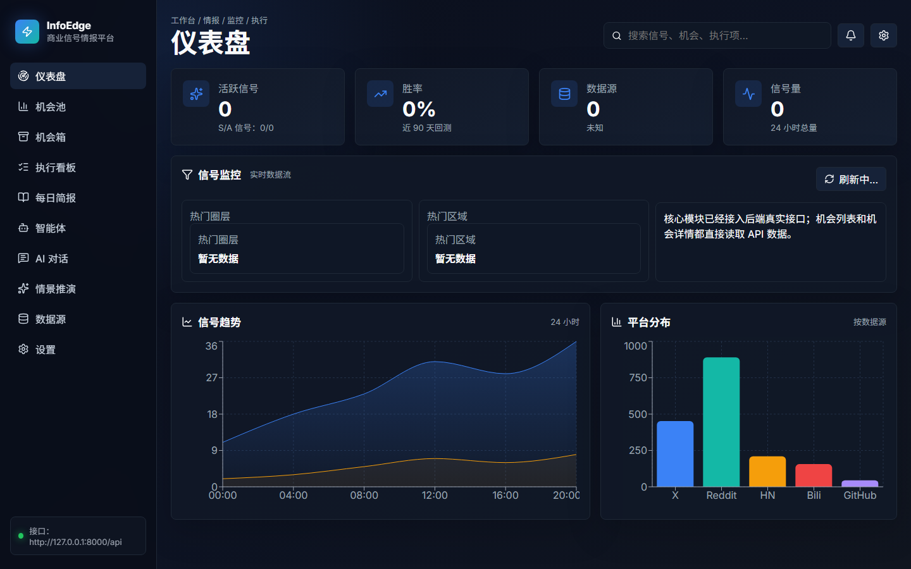

# InfoEdge

InfoEdge is an open-source intelligence workbench for discovering trend signals, scoring business opportunities, and monitoring risk from public and authorized data sources.

The project combines a React/Vite frontend with a FastAPI backend. It organizes public feeds, optional API-based sources, third-party collectors, and restricted data-source placeholders into one workflow for opportunity research.



## Demo

Live demo:

```text
https://gaoyu666.github.io/infoedge/
```

The hosted demo is a static frontend preview. It shows the workbench shell and empty states without requiring private credentials or a running backend.

Run the local workbench with:

```bash
npm install
npm run dev
```

Then open:

```text
http://localhost:5173
```

The frontend can run before the backend is configured. Empty-state dashboards are expected until the FastAPI service and data connectors are running.

## Features

- Source dashboard for public, gated, third-party, and restricted sources.
- Opportunity cards generated from news, communities, open-source projects, finance, geopolitics, supply chain, disaster, and market signals.
- FastAPI data pipeline for source collection, normalization, scoring, caching, and dashboard APIs.
- Model settings UI for GLM and other OpenAI-compatible model providers.
- Acceptance scripts for API and UI behavior checks.

## Tech Stack

- Frontend: React 19, TypeScript, Vite, Recharts, lucide-react
- Backend: Python, FastAPI, SQLAlchemy, Redis, PostgreSQL
- Tests: TypeScript build, Python unittest, Playwright-based acceptance scripts

## Repository Structure

```text
.
|-- src/                       # React frontend
|-- backend/
|   |-- app/                   # FastAPI app, APIs, services, data models
|   |-- tests/                 # Backend tests
|   |-- .env.example           # Backend environment template
|   `-- requirements.txt       # Backend dependencies
|-- docs/assets/               # Screenshots and public documentation assets
|-- scripts/                   # Frontend/API acceptance scripts
|-- package.json               # Frontend dependencies and scripts
|-- PRD_CN.md                  # Chinese product requirements draft
`-- README.md
```

## Quick Start

### 1. Clone the repository

```bash
git clone https://github.com/gaoyu666/infoedge.git
cd infoedge
```

### 2. Start the frontend

```bash
npm install
npm run dev
```

The frontend defaults to:

```text
http://localhost:5173
```

It will try to connect to the backend at:

```text
http://127.0.0.1:8000
http://localhost:8000
```

To override the backend URL, create a local `.env.local` file:

```bash
echo VITE_API_BASE_URL=http://127.0.0.1:8000 > .env.local
```

Do not commit `.env.local`.

### 3. Start the backend

```bash
cd backend
python -m venv .venv
.\.venv\Scripts\Activate.ps1
pip install -r requirements.txt
copy .env.example .env
python -m uvicorn app.main:app --host 0.0.0.0 --port 8000 --reload
```

Health check:

```text
GET http://127.0.0.1:8000/api/health
```

## Environment Variables

The backend template lives at:

```text
backend/.env.example
```

Copy it before local development:

```bash
cd backend
copy .env.example .env
```

Common settings:

```text
PG_USER
PG_PASSWORD
PG_HOST
PG_PORT
PG_DB

REDIS_HOST
REDIS_PORT
REDIS_PASSWORD
REDIS_DB
```

Optional authorized data-source and model settings:

```text
APIFY_TOKEN
GLM_API_KEY
GLM_BASE_URL
GLM_MODEL
```

Security notes:

- Do not commit `backend/.env`, `.env.local`, database passwords, Redis passwords, API keys, cookies, or access tokens.
- Use authorized APIs and provider terms when enabling gated sources.
- Restricted platform sources are documented as placeholders and should not be scraped without permission.

## Data Sources

The frontend source registry currently tracks roughly:

```text
61 public or pullable candidate sources
59 sources requiring keys, tokens, accounts, or relay configuration
28 third-party or pending integration sources
2 restricted platform sources
```

Backend source and pipeline code is mainly in:

```text
backend/app/services/real_pipeline.py
backend/app/services/sources/
src/main.tsx
```

## Useful Commands

Frontend build:

```bash
npm run build
```

Backend source-expansion test:

```bash
cd backend
python -m unittest tests.test_source_expansion -v
```

API acceptance scripts:

```bash
npm run accept:opportunity-actions:api
npm run accept:buttons:api
```

## Roadmap

The near-term roadmap is tracked in [ROADMAP.md](ROADMAP.md). Current priorities are connector coverage, backend reliability, UI empty-state clarity, and maintainable contributor workflows.

For deployment details, see [docs/DEPLOYMENT.md](docs/DEPLOYMENT.md). For local backend services, see [docs/LOCAL_BACKEND.md](docs/LOCAL_BACKEND.md).

## Contributing

Contributions are welcome. Please open an issue or pull request with a clear description, reproduction steps where relevant, and the test command you ran.

For more details, see [CONTRIBUTING.md](CONTRIBUTING.md).

## License

This project is released under the MIT License. See [LICENSE](LICENSE).
