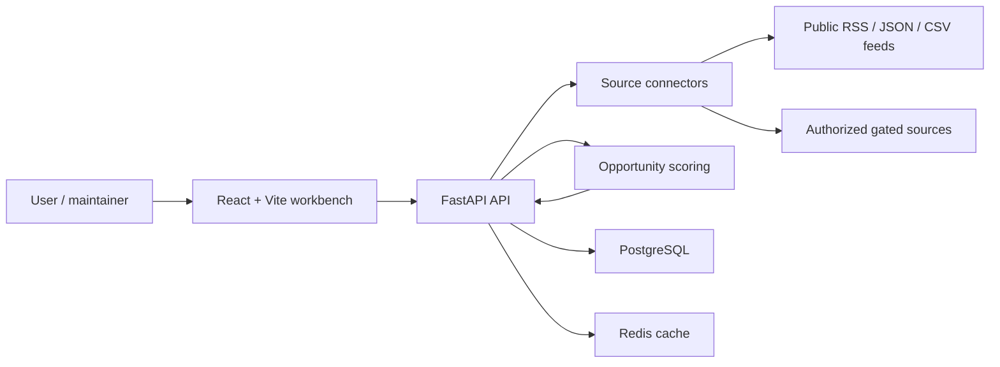
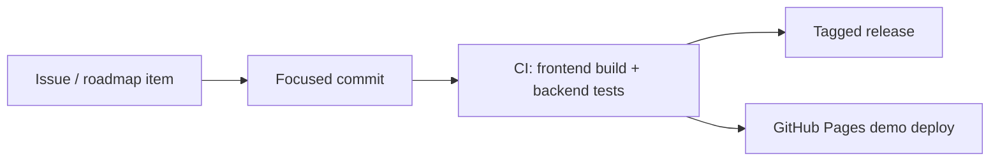

# Architecture

InfoEdge is split into a static React workbench and a FastAPI backend that collects, normalizes, scores, and serves opportunity intelligence.

## Frontend

The frontend is a Vite application in `src/`. It can run as a static GitHub Pages demo without backend credentials. When a backend URL is configured, the dashboard, opportunities, settings, and detail views read FastAPI endpoints.

## Backend

The backend is in `backend/app/`. Its main responsibilities are:

- API routing for dashboard, signal, source, and settings views.
- Source connector registration and cataloging.
- Data normalization into common source records.
- Opportunity scoring, risk metadata, and dashboard summaries.
- Optional model-provider integration through OpenAI-compatible settings.

## Source Connectors

Connectors live under `backend/app/services/sources/` and should follow these rules:

- Public sources must be testable without credentials.
- Gated sources must remain cataloged but not collected until credentials are configured.
- Restricted sources should be documented as placeholders unless authorized access is available.
- Normalization tests should cover IDs, URLs, metrics, timestamps, and malformed payloads.

## CI and Release Flow

CI lives in `.github/workflows/ci.yml`; the static demo deployment lives in `.github/workflows/pages.yml`.
